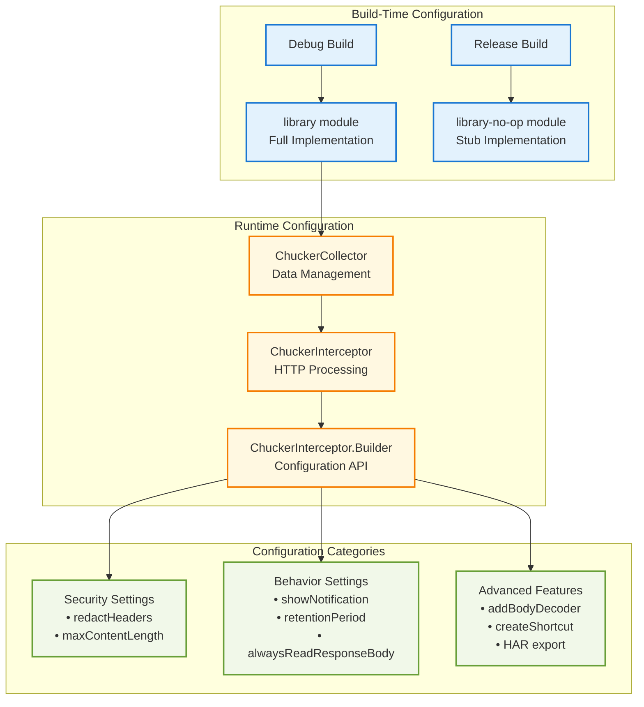
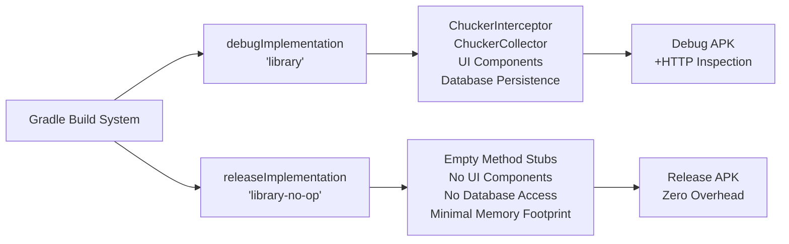
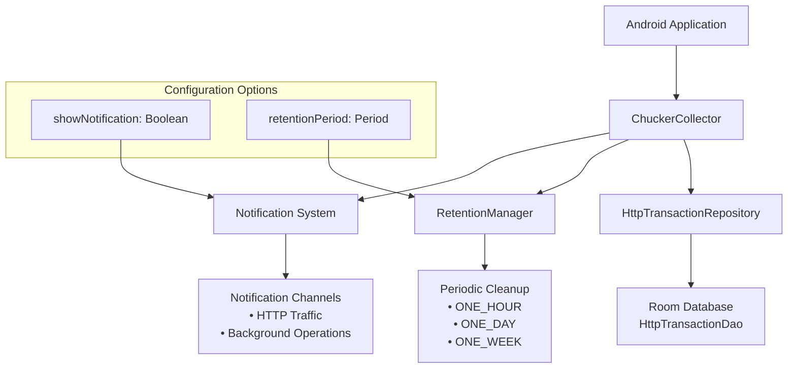
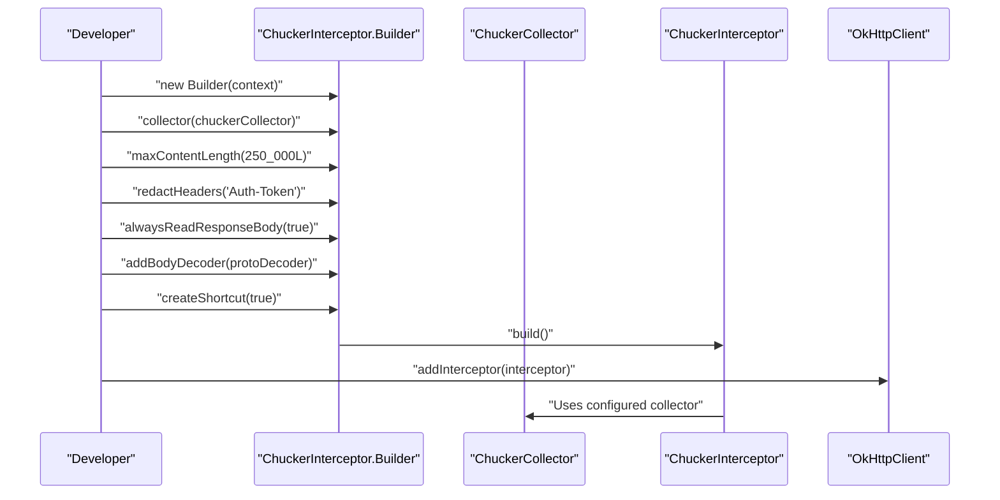
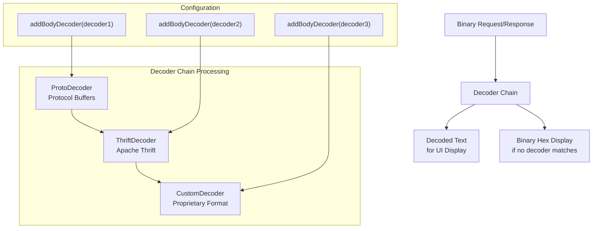
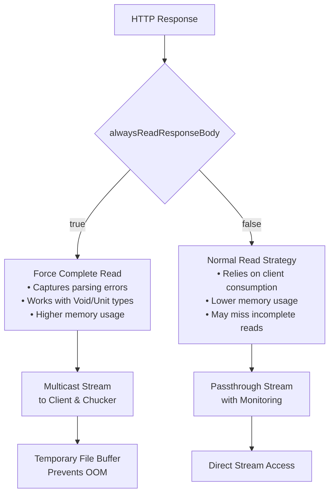
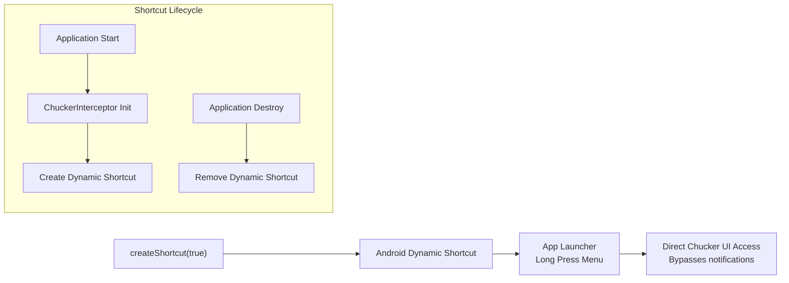

# Advanced Configuration

Relevant source files

The following files were used as context for generating this wiki page:

- [CHANGELOG.md](CHANGELOG.md)
- [README.md](README.md)
- [gradle.properties](gradle.properties)

This page provides comprehensive guidance on advanced configuration options and customization strategies for Chucker. It covers build-time module selection, runtime interceptor configuration, security settings, performance optimization, and advanced features like custom decoders and export functionality.

For basic integration steps, see [Quick Start](#2). For detailed interceptor configuration patterns, see [Interceptor Configuration](#5.1). For practical implementation examples, see [Sample Application](#5.2).

## Configuration Architecture Overview

Chucker's configuration system operates at multiple levels, from build-time module selection to runtime interceptor customization. The architecture separates concerns between build variants, collector behavior, and interceptor processing.

**Sources:** [README.md:34-43](), [README.md:93-128]()

## Build-Time Configuration Strategy

Chucker uses a dual-module approach to eliminate overhead in production builds. The configuration happens entirely at build time through Gradle dependency declarations.

| Build Variant | Module | Behavior | Size Impact |
|---------------|---------|----------|-------------|
| Debug | `library` | Full HTTP inspection with UI | ~400KB |
| Release | `library-no-op` | Empty stub implementations | ~0KB |
| Test | Either variant | Configurable per test needs | Variable |

The module selection ensures zero runtime overhead in production:

**Sources:** [README.md:36-42](), [gradle.properties:20-23]()

## Collector Configuration

The `ChuckerCollector` manages data persistence and notification behavior. It serves as the primary interface between the interceptor and the underlying data storage system.

### Core Collector Settings

| Setting | Type | Default | Purpose |
|---------|------|---------|---------|
| `showNotification` | `Boolean` | `true` | Controls notification visibility |
| `retentionPeriod` | `RetentionManager.Period` | `ONE_WEEK` | Data cleanup frequency |

### Advanced Collector Configuration

**Sources:** [README.md:96-103](), [CHANGELOG.md:101-102]()

## Interceptor Builder Configuration

The `ChuckerInterceptor.Builder` provides a fluent API for comprehensive interceptor customization. This replaces the deprecated parameterized constructor approach.

### Security and Privacy Settings

| Method | Parameters | Purpose |
|--------|------------|---------|
| `redactHeaders()` | `String...` | Hide sensitive header values |
| `maxContentLength()` | `Long` | Limit body content size |

### Processing Behavior Settings

| Method | Parameters | Purpose |
|--------|------------|---------|
| `alwaysReadResponseBody()` | `Boolean` | Force complete response reading |
| `addBodyDecoder()` | `BodyDecoder` | Custom binary format decoding |
| `createShortcut()` | `Boolean` | Android shortcut generation |

### Advanced Configuration Flow

**Sources:** [README.md:106-122](), [CHANGELOG.md:61](), [CHANGELOG.md:78-80]()

## Custom Body Decoders

Chucker supports custom decoders for binary formats like Protocol Buffers, Thrift, or proprietary encodings. Decoders are applied in the order they were added.

### Decoder Interface Implementation

The `BinaryDecoder` interface requires two methods:

| Method | Parameters | Returns | Purpose |
|--------|------------|---------|---------|
| `decodeRequest()` | `Request, ByteString` | `String?` | Decode request bodies |
| `decodeResponse()` | `Response, ByteString` | `String?` | Decode response bodies |

### Decoder Configuration Pattern

**Sources:** [README.md:147-164](), [CHANGELOG.md:8-9]()

## Performance and Resource Management

### Content Length Limits

The `maxContentLength` setting prevents memory issues with large response bodies:

| Limit | Use Case | Memory Impact |
|-------|----------|---------------|
| `250_000L` | Default recommendation | Moderate |
| `1_000_000L` | High-throughput APIs | High |
| `50_000L` | Memory-constrained devices | Low |

### Response Body Reading Strategy

The `alwaysReadResponseBody` setting affects how Chucker handles response consumption:

**Sources:** [README.md:113-116](), [CHANGELOG.md:148-149]()

## Export and Integration Features

### HAR Export Configuration

Chucker supports HTTP Archive (HAR) format export for compatibility with external tools:

| Feature | Availability | Use Case |
|---------|-------------|----------|
| Single transaction HAR | Current | Detailed analysis |
| Transaction list HAR | Current | Batch processing |
| Automated HAR export | Future | CI/CD integration |

### Android Shortcuts

The `createShortcut` feature creates dynamic shortcuts for quick Chucker access:

**Sources:** [CHANGELOG.md:10](), [CHANGELOG.md:12-13](), [README.md:120-121]()

## Migration and Compatibility

### Builder Pattern Migration

The parameterized constructor approach is deprecated in favor of the builder pattern:

| Deprecated | Replacement |
|------------|-------------|
| `ChuckerInterceptor(context, collector, ...)` | `ChuckerInterceptor.Builder(context).collector(...).build()` |

### Version-Specific Features

| Feature | Minimum Version | Status |
|---------|----------------|--------|
| Body decoders | 4.0.0-SNAPSHOT | Development |
| Dynamic shortcuts | 4.0.0-SNAPSHOT | Development |
| HAR export | 3.3.0+ | Stable |
| Builder pattern | 3.4.0+ | Stable |

**Sources:** [CHANGELOG.md:25](), [CHANGELOG.md:61](), [README.md:145]()
