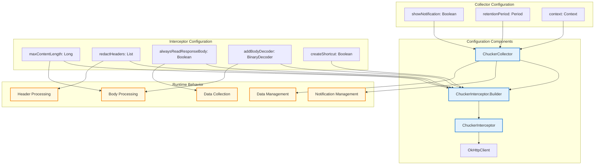
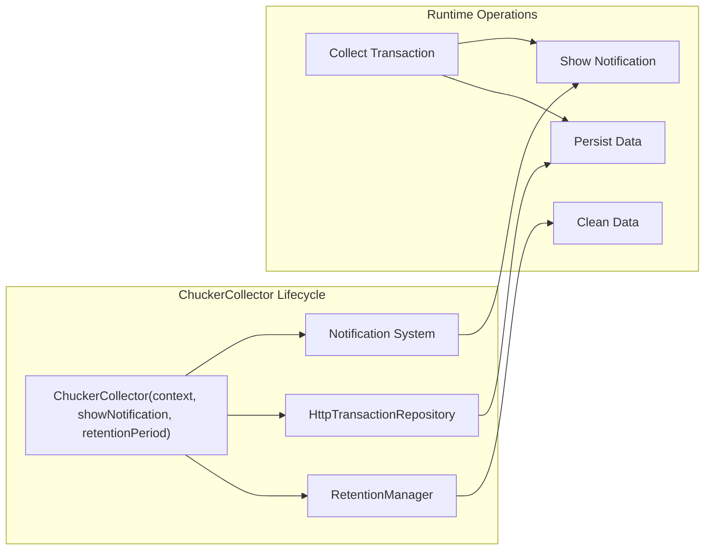
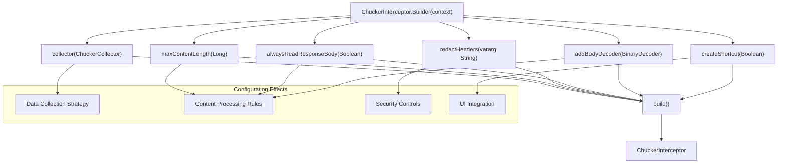
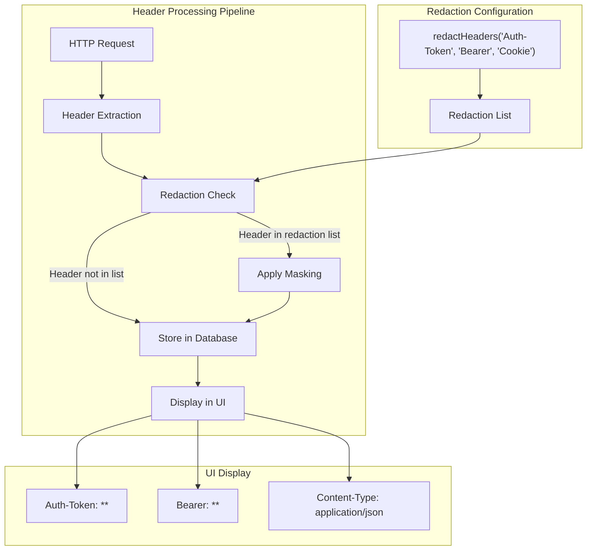
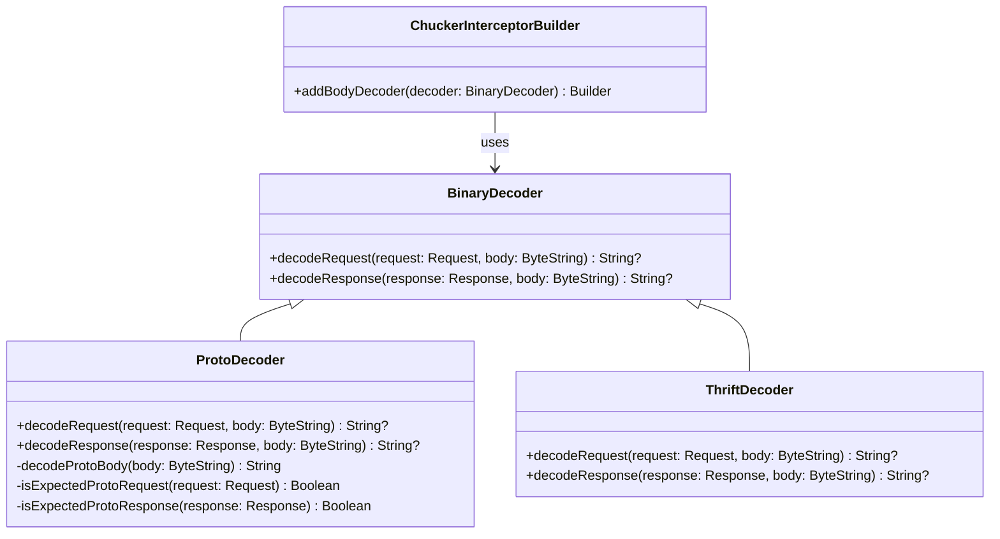
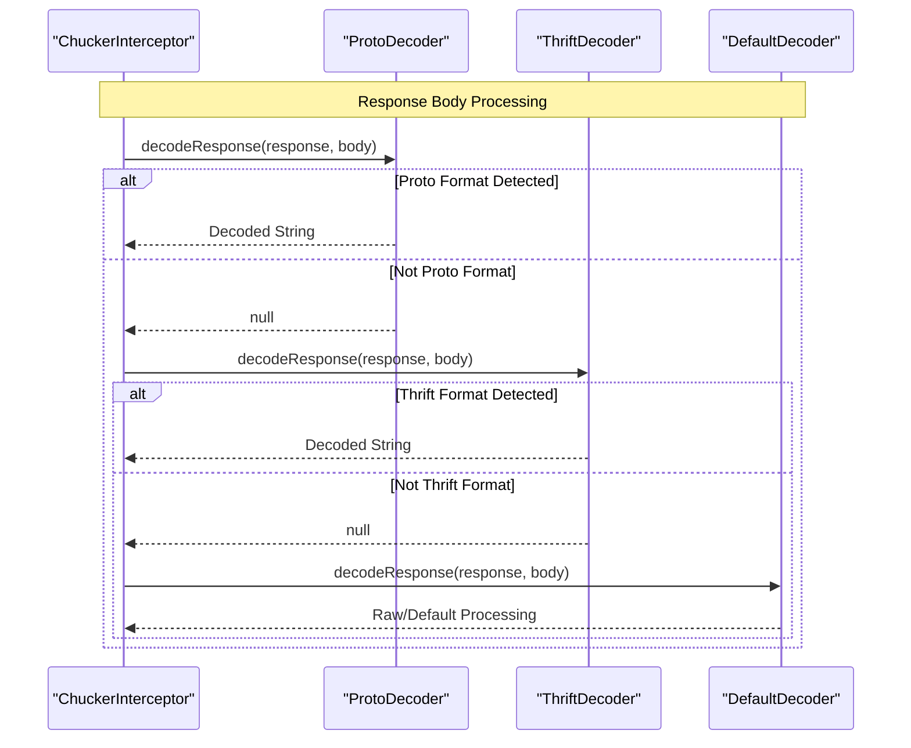
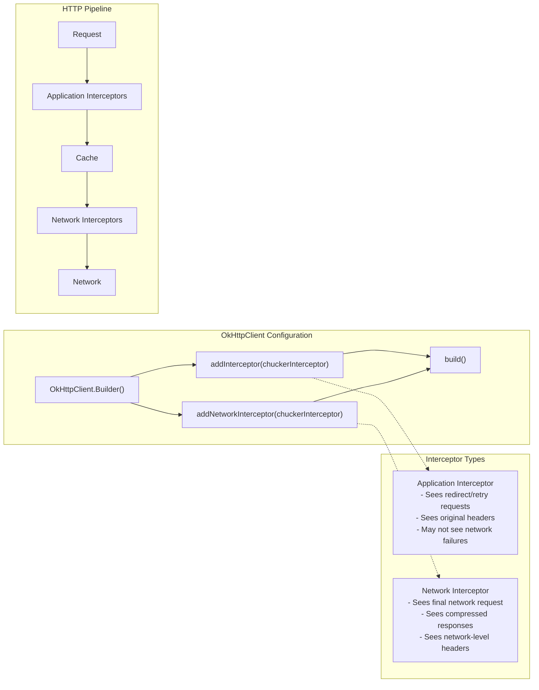

# Interceptor Configuration

Relevant source files

The following files were used as context for generating this wiki page:

- [CHANGELOG.md](CHANGELOG.md)
- [README.md](README.md)
- [gradle.properties](gradle.properties)

This document covers the detailed configuration options for `ChuckerInterceptor` and `ChuckerCollector`, including security settings, custom decoders, and advanced behavioral controls. For information about the overall HTTP interception architecture and flow, see [HTTP Interception Flow](#3.3). For practical integration examples, see [Sample Application](#5.2).

## Configuration Architecture

The Chucker interceptor configuration system is built around two main components: `ChuckerCollector` for data management and `ChuckerInterceptor.Builder` for request/response processing configuration.

**Sources:** [README.md:93-128]()

## ChuckerCollector Configuration

`ChuckerCollector` manages data persistence, retention policies, and notification behavior. It serves as the data management layer for the interceptor system.

### Core Configuration Options

| Option | Type | Purpose | Default |
|--------|------|---------|---------|
| `context` | `Context` | Android application context for database and notifications | Required |
| `showNotification` | `Boolean` | Controls visibility of HTTP activity notifications | `true` |
| `retentionPeriod` | `RetentionManager.Period` | Data retention policy for collected transactions | Varies |

### Data Retention Policies

The `retentionPeriod` parameter accepts predefined periods from `RetentionManager.Period`:
- `ONE_HOUR` - Transactions older than 1 hour are automatically purged
- `ONE_DAY` - 24-hour retention window
- `ONE_WEEK` - 7-day retention window

**Sources:** [README.md:96-103]()

## ChuckerInterceptor Builder Configuration

The `ChuckerInterceptor.Builder` provides a fluent API for configuring request and response processing behavior. This builder pattern was introduced to maintain binary compatibility and provide extensible configuration options.

### Request/Response Processing Configuration

**Sources:** [README.md:105-122](), [CHANGELOG.md:61-62]()

### Configuration Parameter Details

| Method | Parameter Type | Purpose |
|--------|----------------|---------|
| `collector()` | `ChuckerCollector` | Associates data collection and persistence behavior |
| `maxContentLength()` | `Long` | Sets byte limit for response body processing (truncation threshold) |
| `redactHeaders()` | `vararg String` | Specifies headers to mask with `**` in UI |
| `alwaysReadResponseBody()` | `Boolean` | Forces complete response consumption even on parsing errors |
| `addBodyDecoder()` | `BinaryDecoder` | Adds custom decoder for binary formats (Protobuf, Thrift, etc.) |
| `createShortcut()` | `Boolean` | Controls Android dynamic shortcut creation |

## Security Configuration

Security configuration focuses on preventing sensitive data exposure in the Chucker UI through header redaction and content filtering.

### Header Redaction

Headers containing sensitive information can be automatically redacted in the Chucker UI. The `redactHeaders()` method accepts multiple header names and replaces their values with `**` masking.

**Sources:** [README.md:111-112](), [README.md:136-141]()

### Content Length Limitations

The `maxContentLength` setting provides protection against memory exhaustion by truncating response bodies that exceed the specified byte limit.

**Sources:** [README.md:109-110]()

## Custom Body Decoders

Custom body decoders enable Chucker to display binary content formats that are not natively supported (plain text, Gzip, Brotli).

### BinaryDecoder Interface

Custom decoders must implement the `BinaryDecoder` interface, providing separate methods for request and response processing:

### Decoder Processing Chain

Multiple decoders can be installed and are applied in the order they were added. Each decoder can return `null` to indicate it cannot process the content, allowing the next decoder in the chain to attempt processing.

**Sources:** [README.md:118-119](), [README.md:149-164](), [CHANGELOG.md:8-10]()

## OkHttpClient Integration

The final configuration step involves integrating the configured `ChuckerInterceptor` with the `OkHttpClient`. The interceptor can be added as either an application or network interceptor, each providing different visibility into the HTTP processing pipeline.

**Sources:** [README.md:124-127](), [README.md:206-210]()
