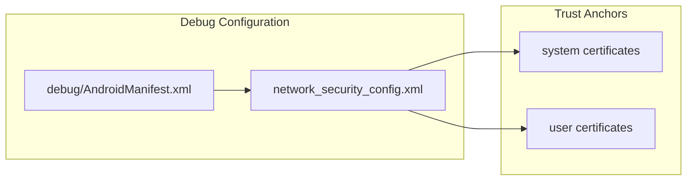

# Sample Application

<details>
<summary>Relevant source files</summary>

The following files were used as context for generating this wiki page:

- [library/src/main/res/menu/chucker_transaction.xml](library/src/main/res/menu/chucker_transaction.xml)
- [library/src/main/res/menu/chucker_transactions_list.xml](library/src/main/res/menu/chucker_transactions_list.xml)
- [sample/src/debug/AndroidManifest.xml](sample/src/debug/AndroidManifest.xml)
- [sample/src/debug/res/xml/network_security_config.xml](sample/src/debug/res/xml/network_security_config.xml)
- [sample/src/main/AndroidManifest.xml](sample/src/main/AndroidManifest.xml)
- [sample/src/main/res/values/dimens.xml](sample/src/main/res/values/dimens.xml)
- [sample/src/main/res/values/strings.xml](sample/src/main/res/values/strings.xml)

</details>


The sample application serves as a reference implementation demonstrating various Chucker integration patterns and configuration options. This module showcases how to properly integrate Chucker into an Android application using different build variants and interceptor configurations.

For basic integration steps, see [Quick Start](#2). For detailed interceptor configuration options, see [Interceptor Configuration](#5.1).

## Module Structure

The sample application is organized as a standard Android application module that demonstrates the dual-dependency pattern essential to Chucker's design:

```mermaid
graph TB
    subgraph "Sample Module Structure"
        MAIN["`sample/src/main/`<br/>**Core Application**"]
        DEBUG["`sample/src/debug/`<br/>**Debug Variant**"]
        
        MAIN --> MANIFEST["`AndroidManifest.xml`<br/>**MainActivity Definition**"]
        MAIN --> STRINGS["`res/values/strings.xml`<br/>**UI Text Resources**"]
        MAIN --> DIMENS["`res/values/dimens.xml`<br/>**Layout Dimensions**"]
        
        DEBUG --> DEBUG_MANIFEST["`AndroidManifest.xml`<br/>**Debug Configuration**"]
        DEBUG --> NETWORK_CONFIG["`res/xml/network_security_config.xml`<br/>**Certificate Trust**"]
    end
    
    subgraph "Build Dependencies"
        DEBUG_DEP["`debugImplementation`<br/>**library module**"]
        RELEASE_DEP["`releaseImplementation`<br/>**library-no-op module**"]
    end
    
    MAIN --> DEBUG_DEP
    MAIN --> RELEASE_DEP
    DEBUG --> DEBUG_DEP
```

**Sources:** [sample/src/main/AndroidManifest.xml:1-24](), [sample/src/debug/AndroidManifest.xml:1-8](), [sample/src/main/res/values/strings.xml:1-11](), [sample/src/main/res/values/dimens.xml:1-6](), [sample/src/debug/res/xml/network_security_config.xml:1-9]()

## Application Configuration

### Main Application Manifest

The sample application defines a standard Android application structure with internet permissions and launcher activity configuration:

| Component | Configuration | Purpose |
|-----------|---------------|---------|
| **MainActivity** | `com.chuckerteam.chucker.sample.MainActivity` | Primary demonstration interface |
| **Permissions** | `android.permission.INTERNET` | Required for HTTP networking |
| **Theme** | `@style/AppTheme` | Application styling |
| **Launch Intent** | `MAIN`/`LAUNCHER` | Application entry point |

### Debug Variant Configuration

The debug build variant includes additional security configuration to support HTTP inspection during development:



The network security configuration enables inspection of HTTPS traffic by trusting both system and user-installed certificates, which is essential for debugging network requests.

**Sources:** [sample/src/debug/AndroidManifest.xml:5-7](), [sample/src/debug/res/xml/network_security_config.xml:2-8]()

## User Interface Components

### Application Strings and Resources

The sample application defines specific UI text that demonstrates Chucker's capabilities:

| Resource | Value | Usage |
|----------|--------|--------|
| **app_name** | "Chucker Sample" | Application title |
| **interceptor_type** | "Interceptor type:" | Configuration option label |
| **application_type** | "Application" | Interceptor placement option |
| **network_type** | "Network" | Interceptor placement option |
| **do_http_activity** | "Do HTTP activity" | Action trigger button |
| **launch_chucker_directly** | "Launch Chucker directly" | Direct UI access button |

### Layout Dimensions

The sample application uses consistent spacing based on Material Design grid principles:

| Dimension | Value | Usage |
|-----------|--------|--------|
| **norm_grid_size** | 8dp | Base grid unit |
| **doub_grid_size** | 16dp | Double spacing unit |
| **max_width** | 500dp | Maximum content width |

**Sources:** [sample/src/main/res/values/strings.xml:1-11](), [sample/src/main/res/values/dimens.xml:1-6]()

## Integration Patterns Demonstrated

### Build Variant Strategy

The sample module demonstrates the critical dual-dependency pattern that enables zero-overhead release builds:

```mermaid
graph TB
    subgraph "Build Configuration Pattern"
        GRADLE_BUILD["`build.gradle`<br/>**Sample Module**"]
        
        DEBUG_CONFIG["`debugImplementation`<br/>**Full Chucker Library**"]
        RELEASE_CONFIG["`releaseImplementation`<br/>**No-Op Stubs**"]
        
        GRADLE_BUILD --> DEBUG_CONFIG
        GRADLE_BUILD --> RELEASE_CONFIG
    end
    
    subgraph "Runtime Behavior"
        DEBUG_BUILD["**Debug Build**<br/>Active HTTP Inspection"]
        RELEASE_BUILD["**Release Build**<br/>No Runtime Overhead"]
        
        DEBUG_CONFIG --> DEBUG_BUILD
        RELEASE_CONFIG --> RELEASE_BUILD
    end
    
    subgraph "Target Dependencies"
        FULL_LIB["`library`<br/>**ChuckerInterceptor**<br/>**ChuckerCollector**<br/>**Database Storage**"]
        NOOP_LIB["`library-no-op`<br/>**Empty Stubs**<br/>**Zero Overhead**"]
        
        DEBUG_BUILD --> FULL_LIB
        RELEASE_BUILD --> NOOP_LIB
    end
```

This pattern ensures that production builds contain no Chucker code while development builds provide full HTTP inspection capabilities.

### Interceptor Configuration Examples

The sample application demonstrates different interceptor placement strategies through its UI options:

| Configuration | Description | Use Case |
|---------------|-------------|----------|
| **Application Interceptor** | Added to OkHttpClient application interceptors | Captures all requests including redirects and retries |
| **Network Interceptor** | Added to OkHttpClient network interceptors | Captures final network requests only |

**Sources:** [sample/src/main/res/values/strings.xml:3-5]()

## Functionality Overview

### Core Features Demonstrated

```mermaid
flowchart TD
    START["`Sample App Launch`"] --> WELCOME["`Welcome Screen`<br/>**intro_title**<br/>**intro_body**"]
    
    WELCOME --> CONFIG{"`Interceptor Configuration`"}
    
    CONFIG --> APP_TYPE["`Application Type`<br/>**OkHttp Application Layer**"]
    CONFIG --> NET_TYPE["`Network Type`<br/>**OkHttp Network Layer**"]
    
    APP_TYPE --> HTTP_ACTION["`Do HTTP Activity`<br/>**Trigger Network Requests**"]
    NET_TYPE --> HTTP_ACTION
    
    HTTP_ACTION --> CHUCKER_DATA["`HTTP Data Collection`<br/>**ChuckerInterceptor**<br/>**ChuckerCollector**"]
    
    WELCOME --> DIRECT["`Launch Chucker Directly`<br/>**Chucker.getLaunchIntent()**"]
    
    CHUCKER_DATA --> INSPECT["`HTTP Inspection UI`"]
    DIRECT --> INSPECT
    
    INSPECT --> FEATURES["`Transaction Details`<br/>**Request/Response**<br/>**Headers/Body**<br/>**Timing Information**"]
```

The sample application provides two primary interaction paths:
1. **Demonstration Flow**: Configure interceptor → Generate HTTP traffic → Inspect results
2. **Direct Access**: Launch Chucker UI directly for existing data

**Sources:** [sample/src/main/res/values/strings.xml:6-10]()

## Development and Testing Support

### Network Security Configuration

For debug builds, the sample includes network security configuration that supports HTTPS inspection:

- **System Certificates**: Standard Android certificate trust store
- **User Certificates**: Allows installation of custom CA certificates for proxy tools
- **Base Configuration**: Applied to all network connections in debug builds

This configuration is essential for developers who need to inspect HTTPS traffic using proxy tools or custom certificate authorities during development.

**Sources:** [sample/src/debug/res/xml/network_security_config.xml:2-8](), [sample/src/debug/AndroidManifest.xml:5-7]()
