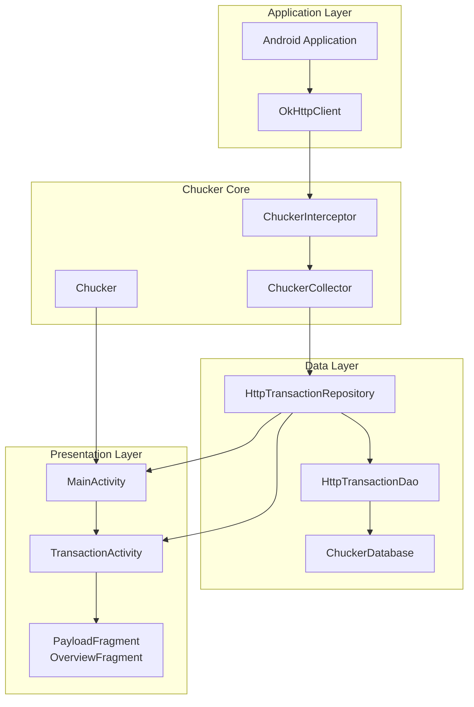
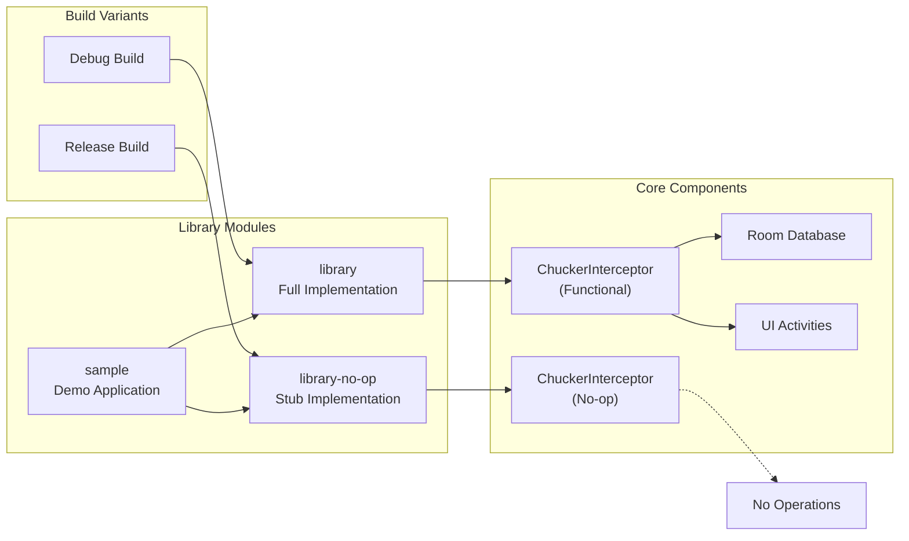
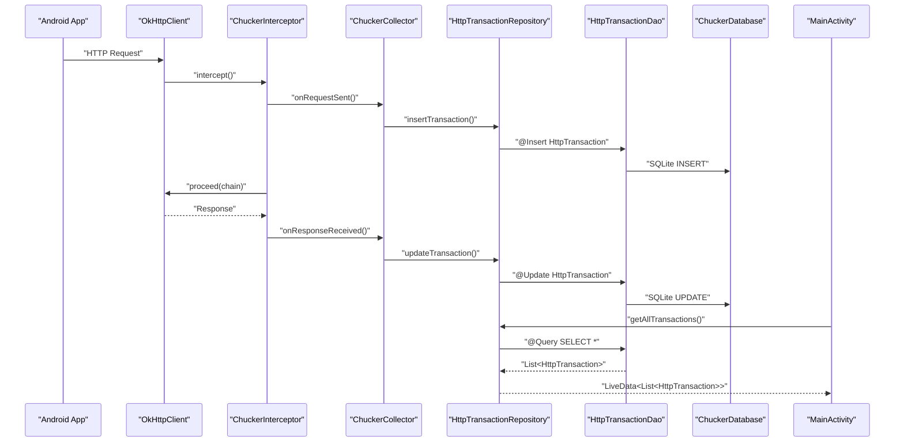
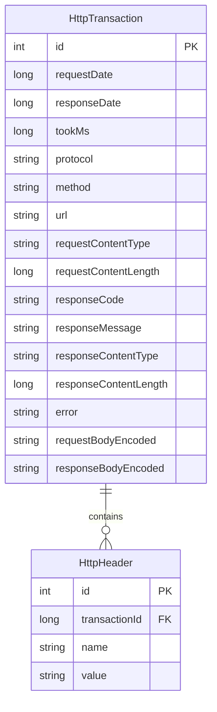
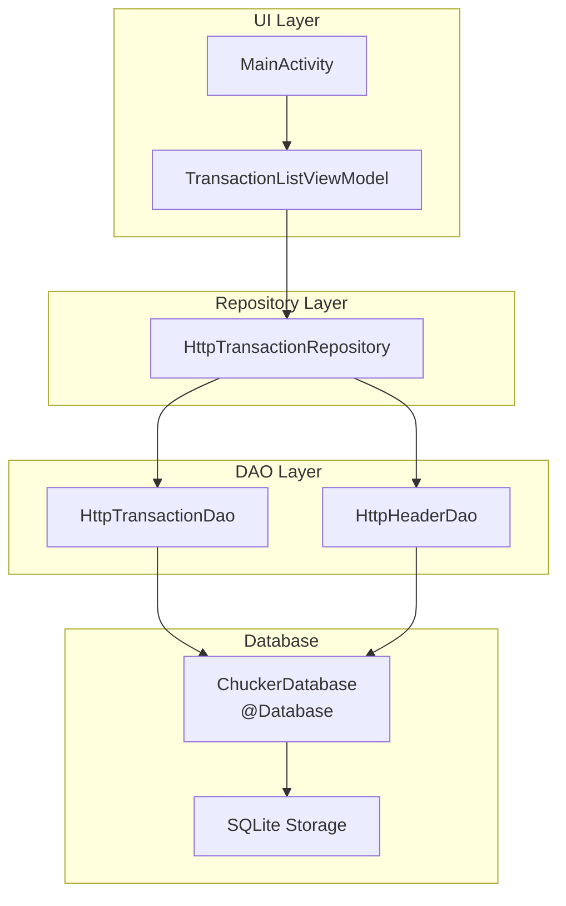
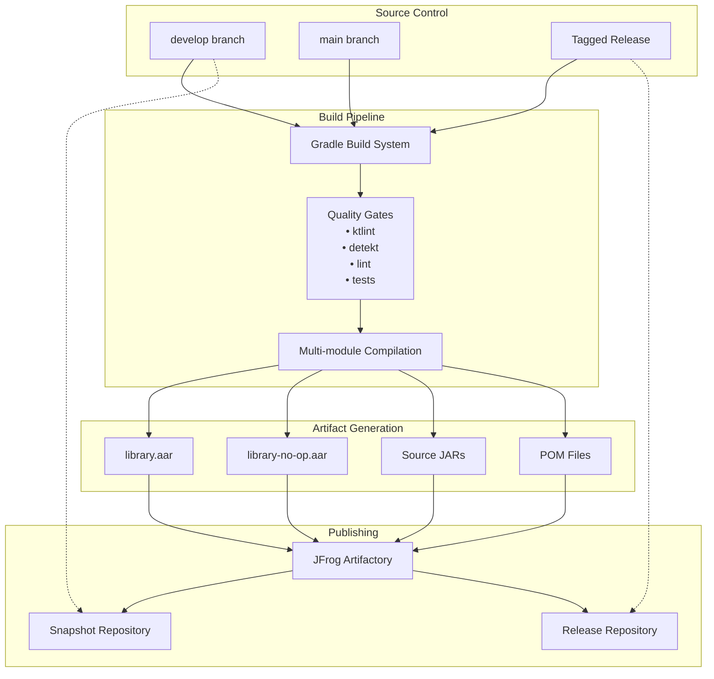
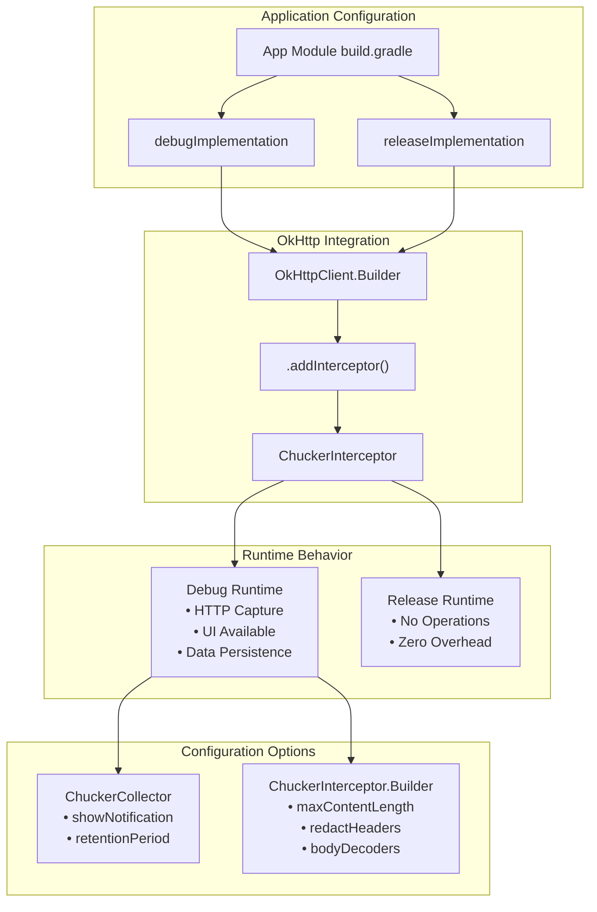

# Architecture

Relevant source files

The following files were used as context for generating this wiki page:

- [CHANGELOG.md](CHANGELOG.md)
- [README.md](README.md)
- [build.gradle](build.gradle)
- [gradle.properties](gradle.properties)
- [gradle/wrapper/gradle-wrapper.properties](gradle/wrapper/gradle-wrapper.properties)
- [library-no-op/build.gradle](library-no-op/build.gradle)
- [library/build.gradle](library/build.gradle)
- [library/src/main/kotlin/com/chuckerteam/chucker/internal/ui/BaseChuckerActivity.kt](library/src/main/kotlin/com/chuckerteam/chucker/internal/ui/BaseChuckerActivity.kt)
- [sample/build.gradle](sample/build.gradle)
- [sample/src/main/kotlin/com/chuckerteam/chucker/sample/MainActivity.kt](sample/src/main/kotlin/com/chuckerteam/chucker/sample/MainActivity.kt)

This document describes the high-level architecture of Chucker, covering the system's modular design, core components, data flow patterns, and build structure. It focuses on how the major subsystems interact to provide HTTP inspection capabilities for Android applications.

For specific API usage patterns, see [Core API](#3.2). For detailed HTTP interception implementation, see [HTTP Interception Flow](#3.3). For build system details, see [Build System](#6.1).

## System Overview

Chucker implements a layered architecture designed around HTTP traffic interception, data persistence, and user interface presentation. The system uses a three-module approach to separate full functionality from no-operation stubs, enabling zero-overhead release builds.

**Sources:** [README.md:24-51](), [build.gradle:1-118](), [library/build.gradle:1-157]()

## Module Architecture

The system implements a three-module strategy to provide conditional functionality based on build configuration.

### Module Responsibilities

| Module | Purpose | Key Components |
|--------|---------|----------------|
| `library` | Full HTTP inspection functionality | `ChuckerInterceptor`, `ChuckerCollector`, Room database, UI activities |
| `library-no-op` | Zero-overhead release stubs | Empty implementations of public API classes |
| `sample` | Integration example and testing | Sample HTTP requests, configuration examples |

**Sources:** [library/build.gradle:1-157](), [library-no-op/build.gradle:1-109](), [sample/build.gradle:1-85]()

## Core Component Data Flow

The HTTP inspection process follows a structured data flow from interception through persistence to presentation.

**Sources:** Based on the overall system diagrams and repository pattern evident in the codebase structure.

## Database Architecture

Chucker uses Room persistence library with a repository pattern for HTTP transaction storage.

### Data Access Pattern

**Sources:** [library/build.gradle:69-71]() (Room dependencies), database architecture inferred from overall system design

## Build and Publishing Architecture

The build system supports multi-module compilation, quality checks, and artifact publishing to multiple repositories.

### Gradle Module Configuration

| Configuration | Purpose | Applied To |
|---------------|---------|------------|
| `debugImplementation` | Full Chucker functionality | Development builds |
| `releaseImplementation` | No-op stubs | Production builds |
| `api` | Exposes OkHttp dependency | Both library modules |
| `implementation` | Internal dependencies | Framework libraries |

**Sources:** [build.gradle:1-118](), [library/build.gradle:115-156](), [library-no-op/build.gradle:67-108](), [sample/build.gradle:69-84]()

## Integration Architecture

Chucker integrates with Android applications through the OkHttp interceptor pattern, providing configuration flexibility and conditional behavior.

**Sources:** [README.md:38-50](), [README.md:95-128](), [sample/src/main/kotlin/com/chuckerteam/chucker/sample/MainActivity.kt:1-81]()
