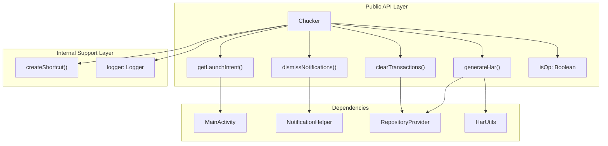
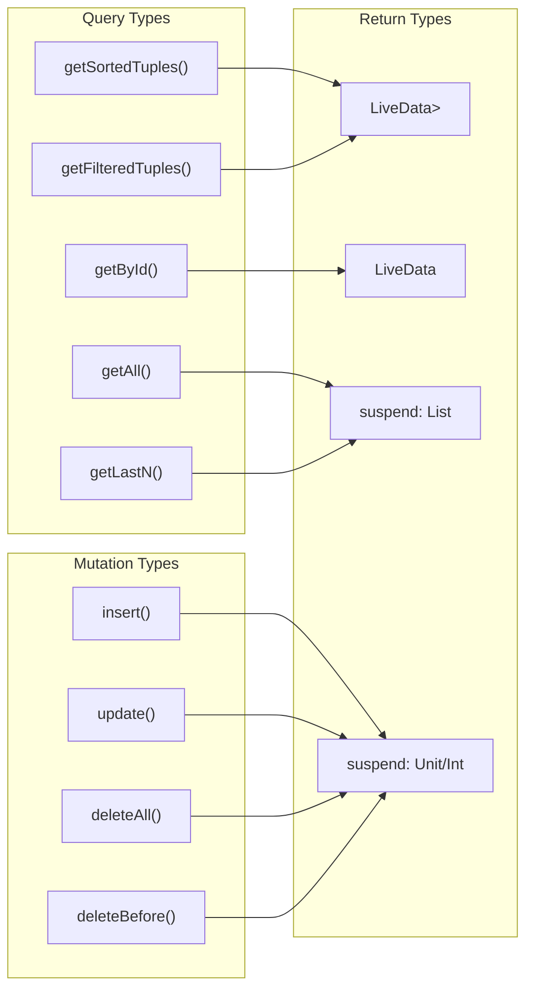
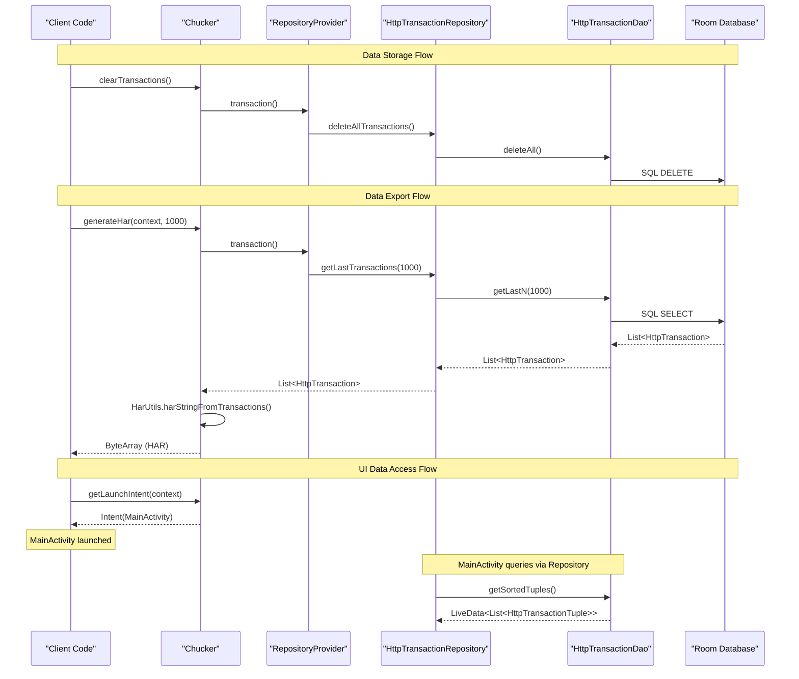

# Core API

<details>
<summary>Relevant source files</summary>

The following files were used as context for generating this wiki page:

- [library/src/main/kotlin/com/chuckerteam/chucker/api/Chucker.kt](library/src/main/kotlin/com/chuckerteam/chucker/api/Chucker.kt)
- [library/src/main/kotlin/com/chuckerteam/chucker/internal/data/repository/HttpTransactionDatabaseRepository.kt](library/src/main/kotlin/com/chuckerteam/chucker/internal/data/repository/HttpTransactionDatabaseRepository.kt)
- [library/src/main/kotlin/com/chuckerteam/chucker/internal/data/repository/HttpTransactionRepository.kt](library/src/main/kotlin/com/chuckerteam/chucker/internal/data/repository/HttpTransactionRepository.kt)
- [library/src/main/kotlin/com/chuckerteam/chucker/internal/data/room/HttpTransactionDao.kt](library/src/main/kotlin/com/chuckerteam/chucker/internal/data/room/HttpTransactionDao.kt)

</details>


This document covers Chucker's main public API and data management layer. It focuses on the `Chucker` object that provides the primary interface for interacting with the library, and the repository pattern used for managing HTTP transaction data persistence.

For information about the interceptor configuration and HTTP capture mechanisms, see [Interceptor Configuration](#5.1). For details about the user interface components, see [Main Interface](#4.1).

## Public API Overview

The core public API is exposed through the `Chucker` object, which serves as the main entry point for developers to interact with the library. This singleton object provides methods for launching the UI, managing notifications, clearing data, and generating HAR exports.

### Chucker Object Structure



**Sources:** [library/src/main/kotlin/com/chuckerteam/chucker/api/Chucker.kt:24-116]()

### Key Public Methods

| Method | Description | Return Type |
|--------|-------------|-------------|
| `getLaunchIntent(context)` | Creates Intent to launch Chucker UI | `Intent` |
| `dismissNotifications(context)` | Dismisses all Chucker notifications | `void` |
| `clearTransactions()` | Removes all stored HTTP transactions | `suspend fun` |
| `generateHar(context, limit)` | Exports transactions as HAR format | `suspend fun: ByteArray` |
| `isOp` | Indicates if this is operational instance | `Boolean` |

**Sources:** [library/src/main/kotlin/com/chuckerteam/chucker/api/Chucker.kt:36-99]()

## Data Management Layer

The data management layer implements the repository pattern to abstract data persistence operations. It consists of three primary components: the repository interface, database implementation, and Room DAO.

### Repository Pattern Architecture

```mermaid
graph TB
    subgraph "API Layer"
        ChuckerAPI["Chucker Object"]
    end

    subgraph "Repository Layer"
        RepoProvider["RepositoryProvider"]
        RepoInterface["HttpTransactionRepository"]
        RepoImpl["HttpTransactionDatabaseRepository"]
    end

    subgraph "Data Access Layer"
        ChuckerDB["ChuckerDatabase"]
        TransactionDao["HttpTransactionDao"]
    end

    subgraph "Entities"
        HttpTransaction["HttpTransaction"]
        HttpTransactionTuple["HttpTransactionTuple"]
    end

    ChuckerAPI --> RepoProvider
    RepoProvider --> RepoInterface
    RepoInterface <|-- RepoImpl
    RepoImpl --> ChuckerDB
    ChuckerDB --> TransactionDao
    TransactionDao --> HttpTransaction
    TransactionDao --> HttpTransactionTuple
```

**Sources:** [library/src/main/kotlin/com/chuckerteam/chucker/internal/data/repository/HttpTransactionRepository.kt:7-31](), [library/src/main/kotlin/com/chuckerteam/chucker/internal/data/repository/HttpTransactionDatabaseRepository.kt:9-47]()

### Repository Interface Operations

The `HttpTransactionRepository` interface defines the contract for data operations:

| Operation Category | Methods |
|-------------------|---------|
| **Create/Update** | `insertTransaction()`, `updateTransaction()` |
| **Delete** | `deleteAllTransactions()`, `deleteOldTransactions()` |
| **Query** | `getSortedTransactionTuples()`, `getFilteredTransactionTuples()`, `getTransaction()` |
| **Bulk Operations** | `getAllTransactions()`, `getLastTransactions()` |

**Sources:** [library/src/main/kotlin/com/chuckerteam/chucker/internal/data/repository/HttpTransactionRepository.kt:14-31]()

### Database Access Layer

The Room DAO provides SQL-based data access with LiveData support for reactive UI updates:



**Sources:** [library/src/main/kotlin/com/chuckerteam/chucker/internal/data/room/HttpTransactionDao.kt:15-49]()

## API Operations and Data Flow

The following sequence demonstrates how the Core API components interact during typical operations:

### Transaction Storage and Retrieval Flow



**Sources:** [library/src/main/kotlin/com/chuckerteam/chucker/api/Chucker.kt:83-99](), [library/src/main/kotlin/com/chuckerteam/chucker/internal/data/repository/HttpTransactionDatabaseRepository.kt:23-46]()

## Integration Points

The Core API serves as the bridge between external client code and Chucker's internal systems:

### External Integration Points

| Integration Point | Purpose | Implementation |
|------------------|---------|----------------|
| **UI Launch** | Start Chucker interface | `getLaunchIntent()` creates `MainActivity` intent |
| **Notification Management** | Control system notifications | `dismissNotifications()` delegates to `NotificationHelper` |
| **Data Lifecycle** | Manage transaction storage | `clearTransactions()` operates through repository layer |
| **Data Export** | Extract HTTP data | `generateHar()` combines repository queries with HAR formatting |

### Internal System Dependencies

The Core API depends on several internal systems:

- **RepositoryProvider**: Factory for accessing data repositories
- **NotificationHelper**: Android notification management
- **HarUtils**: HTTP Archive format generation
- **MainActivity**: Primary UI entry point
- **Logger**: Internal logging infrastructure

**Sources:** [library/src/main/kotlin/com/chuckerteam/chucker/api/Chucker.kt:13-18](), [library/src/main/kotlin/com/chuckerteam/chucker/internal/data/repository/HttpTransactionDatabaseRepository.kt:6-7]()
