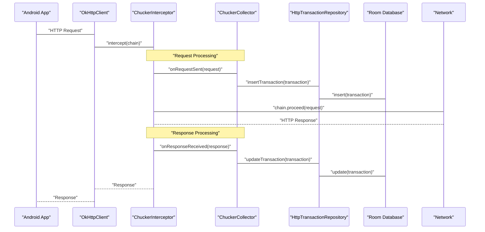

# HTTP Interception Flow

<details>
<summary>Relevant source files</summary>

The following files were used as context for generating this wiki page:

- [CHANGELOG.md](CHANGELOG.md)
- [README.md](README.md)
- [gradle.properties](gradle.properties)
- [library/src/main/kotlin/com/chuckerteam/chucker/api/Chucker.kt](library/src/main/kotlin/com/chuckerteam/chucker/api/Chucker.kt)
- [library/src/main/kotlin/com/chuckerteam/chucker/internal/data/repository/HttpTransactionDatabaseRepository.kt](library/src/main/kotlin/com/chuckerteam/chucker/internal/data/repository/HttpTransactionDatabaseRepository.kt)
- [library/src/main/kotlin/com/chuckerteam/chucker/internal/data/repository/HttpTransactionRepository.kt](library/src/main/kotlin/com/chuckerteam/chucker/internal/data/repository/HttpTransactionRepository.kt)
- [library/src/main/kotlin/com/chuckerteam/chucker/internal/data/room/HttpTransactionDao.kt](library/src/main/kotlin/com/chuckerteam/chucker/internal/data/room/HttpTransactionDao.kt)

</details>


This document explains how Chucker captures, processes, and stores HTTP requests and responses using the `ChuckerInterceptor` and `ChuckerCollector` components. It covers the complete data flow from initial HTTP request interception through persistence in the Room database.

For information about the overall module architecture, see [Module Design](#3.1). For details about the Core API and data management layer, see [Core API](#3.2).

## Overview

Chucker's HTTP interception system operates as an OkHttp interceptor that captures HTTP traffic, processes request/response data, and persists it for inspection through the UI. The system uses a multi-component architecture where `ChuckerInterceptor` handles the OkHttp integration while `ChuckerCollector` manages data processing and storage.

**Sources:** [README.md:24-51](), [README.md:93-128]()

## Core Components

The HTTP interception flow involves several key components working together:

| Component | Role | Location |
|-----------|------|----------|
| `ChuckerInterceptor` | OkHttp interceptor that captures HTTP traffic | `library/src/main/kotlin/com/chuckerteam/chucker/api/ChuckerInterceptor.kt` |
| `ChuckerCollector` | Data collection and notification management | `library/src/main/kotlin/com/chuckerteam/chucker/api/ChuckerCollector.kt` |
| `HttpTransactionRepository` | Data persistence abstraction | [library/src/main/kotlin/com/chuckerteam/chucker/internal/data/repository/HttpTransactionRepository.kt:1-31]() |
| `HttpTransactionDatabaseRepository` | Room-based repository implementation | [library/src/main/kotlin/com/chuckerteam/chucker/internal/data/repository/HttpTransactionDatabaseRepository.kt:1-47]() |
| `HttpTransactionDao` | Database access object for transactions | [library/src/main/kotlin/com/chuckerteam/chucker/internal/data/room/HttpTransactionDao.kt:1-50]() |

**Sources:** [library/src/main/kotlin/com/chuckerteam/chucker/internal/data/repository/HttpTransactionRepository.kt:1-31](), [library/src/main/kotlin/com/chuckerteam/chucker/internal/data/repository/HttpTransactionDatabaseRepository.kt:1-47](), [library/src/main/kotlin/com/chuckerteam/chucker/internal/data/room/HttpTransactionDao.kt:1-50]()

## HTTP Request Interception Flow

The complete flow from HTTP request initiation to data persistence follows this sequence:



**Sources:** [README.md:45-51](), [README.md:106-127]()

## Component Architecture and Data Flow

This diagram shows how the core components interact and the flow of HTTP transaction data:

```mermaid
flowchart TD
    subgraph "OkHttp_Layer" ["OkHttp Integration Layer"]
        "OkHttpClient"["OkHttpClient"]
        "ChuckerInterceptor"["ChuckerInterceptor"]
        "OkHttpClient" --> "ChuckerInterceptor"
    end
    
    subgraph "Collection_Layer" ["Data Collection Layer"]
        "ChuckerCollector"["ChuckerCollector"]
        "RetentionManager"["RetentionManager"]
        "NotificationHelper"["NotificationHelper"]
        "ChuckerCollector" --> "RetentionManager"
        "ChuckerCollector" --> "NotificationHelper"
    end
    
    subgraph "Persistence_Layer" ["Data Persistence Layer"]
        "HttpTransactionRepository"["HttpTransactionRepository<br/>(Interface)"]
        "HttpTransactionDatabaseRepository"["HttpTransactionDatabaseRepository"]
        "HttpTransactionDao"["HttpTransactionDao"]
        "ChuckerDatabase"["ChuckerDatabase<br/>(Room)"]
        
        "HttpTransactionRepository" --> "HttpTransactionDatabaseRepository"
        "HttpTransactionDatabaseRepository" --> "HttpTransactionDao"
        "HttpTransactionDao" --> "ChuckerDatabase"
    end
    
    subgraph "Entity_Layer" ["Data Entities"]
        "HttpTransaction"["HttpTransaction"]
        "HttpTransactionTuple"["HttpTransactionTuple"]
    end
    
    "ChuckerInterceptor" --> "ChuckerCollector"
    "ChuckerCollector" --> "HttpTransactionRepository"
    "HttpTransactionDao" --> "HttpTransaction"
    "HttpTransactionDao" --> "HttpTransactionTuple"
```

**Sources:** [library/src/main/kotlin/com/chuckerteam/chucker/internal/data/repository/HttpTransactionRepository.kt:7-11](), [library/src/main/kotlin/com/chuckerteam/chucker/internal/data/repository/HttpTransactionDatabaseRepository.kt:9-11]()

## Database Operations Flow

The persistence layer handles various database operations through the Repository pattern:

```mermaid
flowchart LR
    subgraph "Repository_Operations" ["Repository Operations"]
        "insertTransaction"["insertTransaction()"]
        "updateTransaction"["updateTransaction()"]
        "getTransaction"["getTransaction()"]
        "getSortedTransactionTuples"["getSortedTransactionTuples()"]
        "getFilteredTransactionTuples"["getFilteredTransactionTuples()"]
        "deleteOldTransactions"["deleteOldTransactions()"]
        "deleteAllTransactions"["deleteAllTransactions()"]
    end
    
    subgraph "DAO_Operations" ["HttpTransactionDao Operations"]
        "insert_dao"["insert()"]
        "update_dao"["update()"]
        "getById_dao"["getById()"]
        "getSortedTuples_dao"["getSortedTuples()"]
        "getFilteredTuples_dao"["getFilteredTuples()"]
        "deleteBefore_dao"["deleteBefore()"]
        "deleteAll_dao"["deleteAll()"]
    end
    
    "insertTransaction" --> "insert_dao"
    "updateTransaction" --> "update_dao"
    "getTransaction" --> "getById_dao"
    "getSortedTransactionTuples" --> "getSortedTuples_dao"
    "getFilteredTransactionTuples" --> "getFilteredTuples_dao"
    "deleteOldTransactions" --> "deleteBefore_dao"
    "deleteAllTransactions" --> "deleteAll_dao"
```

**Sources:** [library/src/main/kotlin/com/chuckerteam/chucker/internal/data/repository/HttpTransactionRepository.kt:12-31](), [library/src/main/kotlin/com/chuckerteam/chucker/internal/data/room/HttpTransactionDao.kt:12-50]()

## Configuration and Customization

The HTTP interception flow can be configured through the `ChuckerInterceptor.Builder` and `ChuckerCollector`:

### ChuckerCollector Configuration
- `showNotification`: Controls notification display
- `retentionPeriod`: Sets data retention duration via `RetentionManager.Period`

### ChuckerInterceptor Configuration
- `maxContentLength`: Limits response body size for processing
- `redactHeaders()`: Redacts sensitive headers in storage
- `alwaysReadResponseBody`: Forces complete response body reading
- `addBodyDecoder()`: Adds custom body decoders for binary formats
- `createShortcut()`: Controls Android shortcut creation

**Sources:** [README.md:93-128](), [README.md:130-141](), [README.md:143-164]()

## Data Access Patterns

The repository layer provides multiple access patterns for HTTP transaction data:

| Method | Return Type | Purpose |
|--------|-------------|---------|
| `getSortedTransactionTuples()` | `LiveData<List<HttpTransactionTuple>>` | Real-time transaction list for UI |
| `getFilteredTransactionTuples()` | `LiveData<List<HttpTransactionTuple>>` | Filtered transactions by code/path |
| `getTransaction()` | `LiveData<HttpTransaction?>` | Individual transaction details |
| `getAllTransactions()` | `List<HttpTransaction>` | All transactions for export |
| `getLastTransactions()` | `List<HttpTransaction>` | Recent transactions with limit |

**Sources:** [library/src/main/kotlin/com/chuckerteam/chucker/internal/data/repository/HttpTransactionRepository.kt:22-30](), [library/src/main/kotlin/com/chuckerteam/chucker/internal/data/repository/HttpTransactionDatabaseRepository.kt:13-46]()

## Error Handling and Edge Cases

The interception flow handles several edge cases:
- **Large Response Bodies**: Content length limiting prevents memory issues
- **Binary Content**: Custom body decoders handle non-text formats
- **Network Failures**: Error information is captured and stored
- **Incomplete Responses**: `alwaysReadResponseBody` ensures complete data capture

**Sources:** [README.md:109-119](), [CHANGELOG.md:14-22]()
