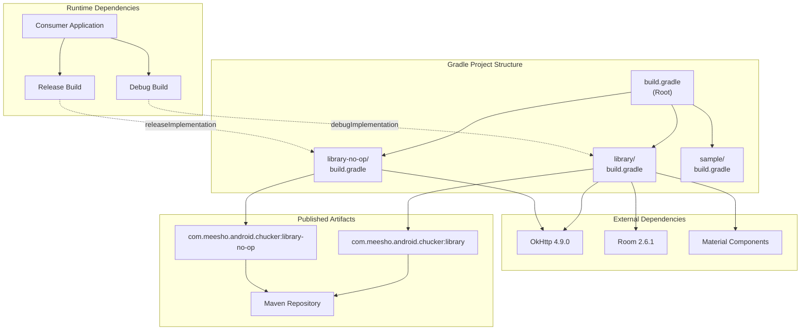
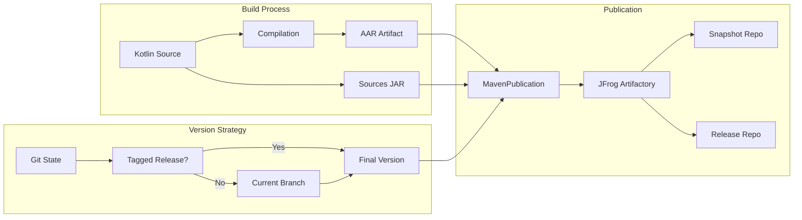
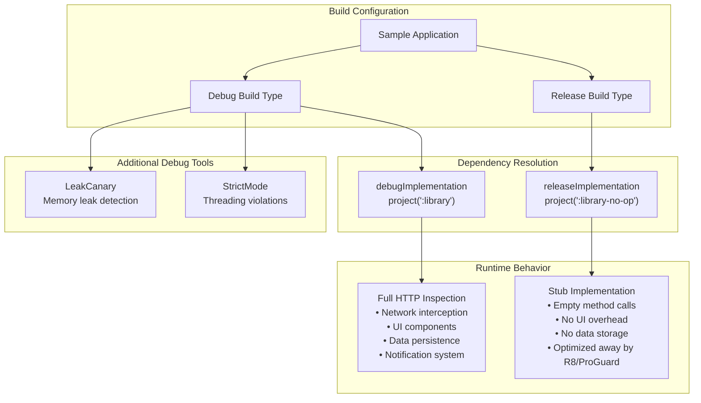
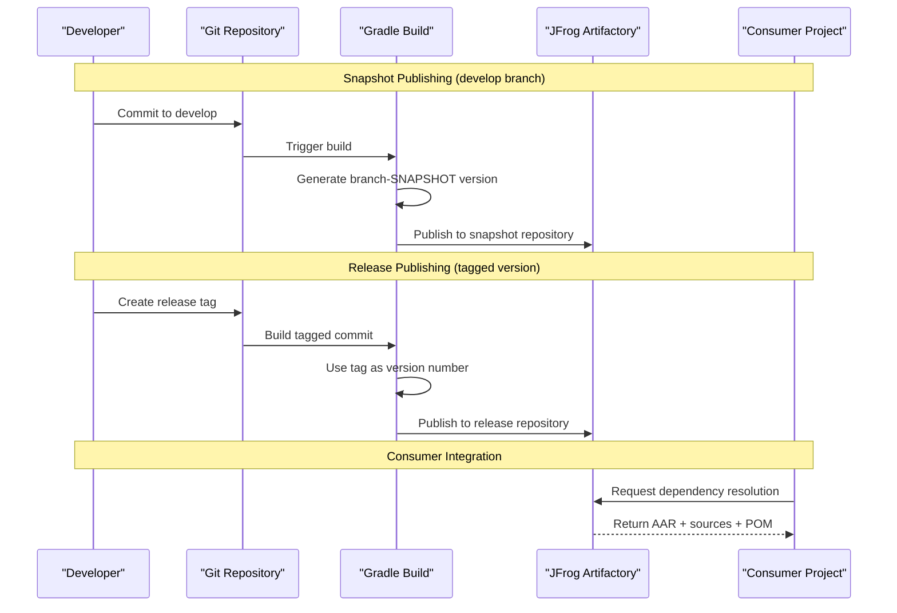

# Module Design

<details>
<summary>Relevant source files</summary>

The following files were used as context for generating this wiki page:

- [build.gradle](build.gradle)
- [gradle/wrapper/gradle-wrapper.properties](gradle/wrapper/gradle-wrapper.properties)
- [library-no-op/build.gradle](library-no-op/build.gradle)
- [library/build.gradle](library/build.gradle)
- [library/src/main/kotlin/com/chuckerteam/chucker/internal/ui/BaseChuckerActivity.kt](library/src/main/kotlin/com/chuckerteam/chucker/internal/ui/BaseChuckerActivity.kt)
- [sample/build.gradle](sample/build.gradle)
- [sample/src/main/kotlin/com/chuckerteam/chucker/sample/MainActivity.kt](sample/src/main/kotlin/com/chuckerteam/chucker/sample/MainActivity.kt)

</details>


This document explains Chucker's three-module architecture and build system strategy. The design enables zero-overhead HTTP inspection in production builds while providing full functionality during development. For information about the CI/CD pipeline that builds and publishes these modules, see [CI/CD Pipeline](#6.2). For details about integrating these modules into your application, see [Quick Start](#2).

## Architecture Overview

Chucker uses a three-module Gradle project structure designed around build variant optimization:

| Module | Purpose | Build Type Usage |
|--------|---------|-----------------|
| `library` | Full HTTP inspection implementation | Debug builds |
| `library-no-op` | Stub implementation with zero overhead | Release builds |
| `sample` | Reference integration and testing | Development |

This architecture allows applications to include full HTTP inspection capabilities during development while completely eliminating the overhead in production releases through compile-time module substitution.

### Module Dependency Graph



Sources: [build.gradle:1-118](), [library/build.gradle:1-157](), [library-no-op/build.gradle:1-109](), [sample/build.gradle:69-84]()

## Library Module (Full Implementation)

The `library` module provides the complete HTTP inspection functionality including UI components, data persistence, and network interception capabilities.

### Key Components and Dependencies

The module includes comprehensive functionality through these dependency categories:

**Core Framework Dependencies:**
- Android SDK and Kotlin standard library
- Material Design Components for UI
- AndroidX Activity, Fragment, and ViewModel components
- Room database for HTTP transaction persistence

**HTTP Processing Dependencies:**  
- OkHttp for network interception
- Gson for JSON serialization
- Brotli decoder for compressed content
- Custom JSON view component for payload display

**Build Configuration:**
- Explicit API mode enforced via compiler flags [library/build.gradle:12-14]()
- Resource prefixing with `chucker_` to avoid conflicts [library/build.gradle:55]()
- ProGuard rules for release optimization [library/build.gradle:19]()
- View binding enabled for UI components [library/build.gradle:28]()

### Publishing Configuration



The version naming strategy automatically determines artifact versioning: tagged commits produce release versions, while branch commits generate `{branch}-SNAPSHOT` versions [library/build.gradle:96-105]().

Sources: [library/build.gradle:58-94](), [library/build.gradle:107-157]()

## Library-No-Op Module (Stub Implementation)

The `library-no-op` module provides API-compatible stub implementations that compile to minimal bytecode, ensuring zero runtime overhead in production builds.

### Minimal Dependency Strategy

The no-op module maintains strict dependency minimization:

**Core Dependencies:**
- OkHttp API compatibility (required for interceptor interface)
- Kotlin standard library (minimal runtime support)

**Excluded Dependencies:**
- No Room database or persistence layer
- No Android UI components or Material Design
- No JSON processing or content decoding libraries
- No AndroidX lifecycle or architecture components

### Implementation Approach

The module provides empty implementations of all public APIs defined in the full library, ensuring:

- **Compile-time compatibility**: Applications compile identically against both modules
- **Runtime elimination**: All Chucker operations become no-ops that get optimized away
- **API surface parity**: Identical public interface prevents integration issues

### Build Configuration Comparison

| Configuration | `library` | `library-no-op` |
|--------------|-----------|-----------------|
| View Binding | Enabled | Disabled |
| Build Config | Disabled | Disabled |  
| Resource Prefix | `chucker_` | None needed |
| API Dependencies | 15+ libraries | 2 libraries only |
| Module Size | ~2MB | ~50KB |

Sources: [library-no-op/build.gradle:1-46](), [library-no-op/build.gradle:59-108]()

## Sample Module (Reference Application)

The `sample` module demonstrates proper integration patterns and serves as a testing platform for Chucker functionality.

### Integration Pattern Implementation

The sample application showcases the recommended dependency configuration:

```gradle
debugImplementation project(':library')
releaseImplementation project(':library-no-op')
```

This pattern ensures development builds include full HTTP inspection while production builds use stub implementations [sample/build.gradle:70-71]().

### Build Variant Strategy



### Development Features

The sample includes additional development tools that complement Chucker:

**Debugging Configuration:**
- LeakCanary integration for memory leak detection [sample/build.gradle:83]()
- StrictMode policies for threading and disk access violations [sample/src/main/kotlin/com/chuckerteam/chucker/sample/MainActivity.kt:58-73]()
- Debug keystore for consistent signing across development environments [sample/build.gradle:40-47]()

**HTTP Testing Infrastructure:**
- Multiple HTTP task implementations for testing different scenarios
- OkHttp client configuration examples
- Interceptor type selection for testing application vs network interceptor behavior

Sources: [sample/build.gradle:69-84](), [sample/src/main/kotlin/com/chuckerteam/chucker/sample/MainActivity.kt:12-24]()

## Build System Integration

The root build configuration coordinates the multi-module project and establishes shared build conventions.

### Global Build Configuration

```mermaid
graph TB
    subgraph "Root Build Script"
        buildscript["buildscript block"]
        allprojects["allprojects block"]
        extensions["ext properties"]
    end
    
    subgraph "Shared Dependencies"
        kotlin["Kotlin 1.9.23"]
        android_gradle["Android Gradle 8.9.1"] 
        okhttp["OkHttp 4.9.0"]
        room["Room 2.6.1"]
        material["Material 1.2.1"]
    end
    
    subgraph "Build Tools"
        ktlint["KtLint Code Style"]
        binary_compat["API Compatibility Validator"]
        dokka["Documentation Generator"]
        wire["Protocol Buffer Support"]
    end
    
    subgraph "Publishing Infrastructure"
        maven_publish["Maven Publish Plugin"]
        artifactory_plugin["JFrog Artifactory Plugin"]
        version_mgmt["Version Management"]
    end
    
    buildscript --> kotlin
    buildscript --> android_gradle
    buildscript --> ktlint
    buildscript --> binary_compat
    buildscript --> dokka
    buildscript --> wire
    
    allprojects --> maven_publish
    allprojects --> artifactory_plugin
    allprojects --> version_mgmt
```



### SDK Version Strategy

The project maintains compatibility across a wide Android SDK range:

| SDK Configuration | Value | Rationale |
|------------------|-------|-----------|
| `minSdkVersion` | 21 (Android 5.0) | Maximum device coverage |
| `targetSdkVersion` | 35 (Android 15) | Latest platform features |
| `compileSdkVersion` | 35 (Android 15) | Latest development APIs |

This configuration balances modern platform capabilities with broad device compatibility [build.gradle:113-116]().

Sources: [build.gradle:1-118](), [build.gradle:64-99]()

## Publishing and Distribution

Both library modules use identical publishing strategies with artifact-specific configurations.

### Artifact Publication Flow



### Repository Configuration

The build system supports multiple repository endpoints through property-based configuration:

**Repository Types:**
- Snapshot repository for development builds (`SNAPSHOT_REPO_NAME`)
- Release repository for tagged versions (`RELEASE_REPO_NAME`) 
- Authentication via `JFROG_ARTIFACTORY_USERNAME` and `JFROG_ARTIFACTORY_KEY`

**Artifact Structure:**
- Group ID: `com.meesho.android.chucker`
- Artifact IDs: `library` and `library-no-op`
- Published files: AAR binary, sources JAR, and generated POM

Sources: [library/build.gradle:138-156](), [library-no-op/build.gradle:90-108]()
