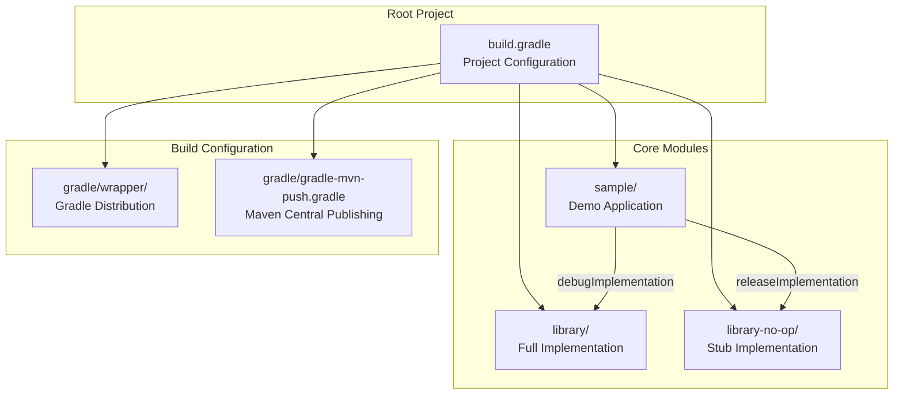
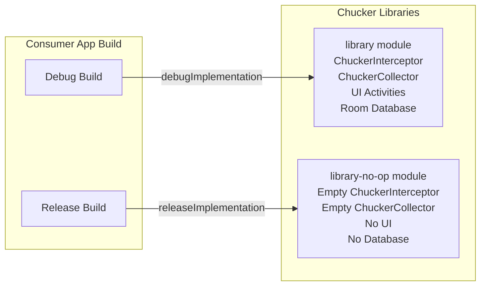
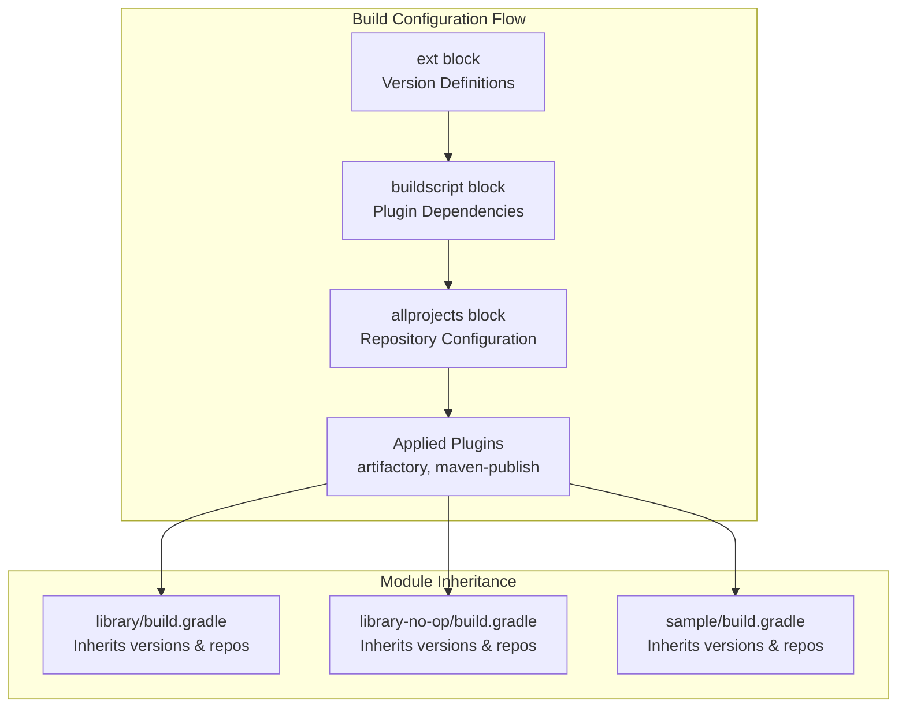
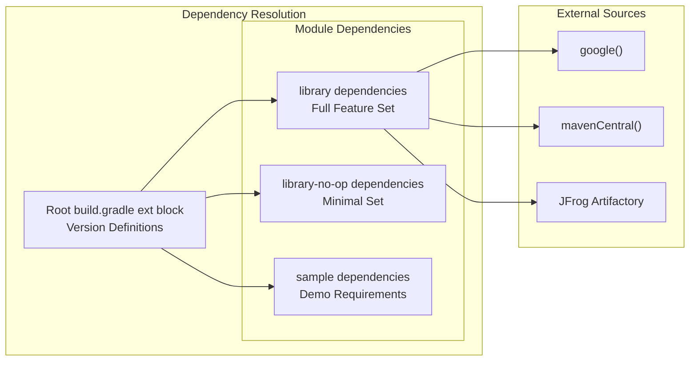
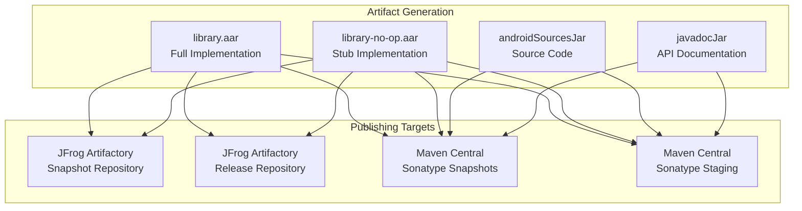
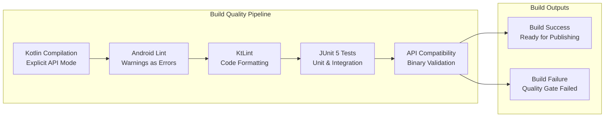

# Build System

Relevant source files

The following files were used as context for generating this wiki page:

- [.editorconfig](.editorconfig)
- [.gitattributes](.gitattributes)
- [.gitignore](.gitignore)
- [build.gradle](build.gradle)
- [gradle/gradle-mvn-push.gradle](gradle/gradle-mvn-push.gradle)
- [gradle/wrapper/gradle-wrapper.jar](gradle/wrapper/gradle-wrapper.jar)
- [gradle/wrapper/gradle-wrapper.properties](gradle/wrapper/gradle-wrapper.properties)
- [gradlew](gradlew)
- [gradlew.bat](gradlew.bat)
- [library-no-op/build.gradle](library-no-op/build.gradle)
- [library/build.gradle](library/build.gradle)
- [library/src/main/kotlin/com/chuckerteam/chucker/internal/ui/BaseChuckerActivity.kt](library/src/main/kotlin/com/chuckerteam/chucker/internal/ui/BaseChuckerActivity.kt)
- [sample/build.gradle](sample/build.gradle)
- [sample/src/main/kotlin/com/chuckerteam/chucker/sample/MainActivity.kt](sample/src/main/kotlin/com/chuckerteam/chucker/sample/MainActivity.kt)

This document covers Chucker's Gradle-based build system, including multi-module architecture, dependency management, build variants strategy, and artifact publishing workflows. For information about continuous integration and deployment pipelines, see [CI/CD Pipeline](#6.2). For development workflow and contribution guidelines, see [Contributing](#6.3).

## Module Architecture

Chucker uses a three-module Gradle build structure designed to provide zero-overhead release builds while maintaining full debugging capabilities during development.

### Module Structure

**Module Dependencies and Build Variants**

Sources: [sample/build.gradle:70-71](), [build.gradle:1-118](), [library/build.gradle:1-157](), [library-no-op/build.gradle:1-109]()

### Build Variants Strategy

The build system implements a dual-library approach where the same public API is provided by two different implementations:

| Build Type | Dependency | Behavior |
|------------|------------|----------|
| Debug | `library` | Full HTTP inspection, UI, persistence |
| Release | `library-no-op` | Empty stubs, zero runtime overhead |

**Implementation Details**

Sources: [sample/build.gradle:70-71](), [library-no-op/build.gradle:43-46]()

## Build Configuration

### Root Project Configuration

The root `build.gradle` establishes the foundation for all modules with centralized version management and plugin configuration.

**Key Configuration Elements:**

| Component | Purpose | Configuration |
|-----------|---------|---------------|
| Buildscript | Plugin dependencies and versions | [build.gradle:1-62]() |
| Version Management | Centralized dependency versions | [build.gradle:2-44]() |
| Repository Setup | Maven/Google/JFrog repositories | [build.gradle:46-92]() |
| SDK Configuration | Min/Target/Compile SDK versions | [build.gradle:112-116]() |

**Global Build Properties**

Sources: [build.gradle:112-116](), [build.gradle:2-44]()

### Module-Specific Configurations

#### Library Module

The main `library` module contains the full Chucker implementation with comprehensive Android library configuration.

**Key Features:**
- Kotlin compilation with explicit API mode: [library/build.gradle:11-14]()
- ViewBinding and Room database integration: [library/build.gradle:27-30](), [library/build.gradle:69-71]()
- Comprehensive dependency set including Material Design, OkHttp, Room: [library/build.gradle:58-94]()
- Resource prefix enforcement: [library/build.gradle:55]()

#### No-Op Module  

The `library-no-op` module provides stub implementations with minimal dependencies.

**Minimal Configuration:**
- Only essential dependencies (OkHttp, Kotlin): [library-no-op/build.gradle:43-46]()
- No ViewBinding, Room, or UI dependencies
- Same public API surface as full library
- Identical publishing configuration: [library-no-op/build.gradle:67-108]()

Sources: [library/build.gradle:1-157](), [library-no-op/build.gradle:1-109]()

## Dependency Management

### Version Centralization

All dependency versions are centralized in the root build file's `ext` block, enabling consistent version management across modules.

**Major Dependency Categories:**

| Category | Key Dependencies | Version Variables |
|----------|------------------|-------------------|
| Kotlin | kotlin-stdlib, coroutines | `kotlinVersion`, `coroutineVersion` |
| Android | AppCompat, Material, Room | `appCompatVersion`, `materialComponentsVersion`, `roomVersion` |
| Networking | OkHttp, Retrofit | `okhttpVersion`, `retrofitVersion` |
| Testing | JUnit, MockK, Truth | `junitVersion`, `mockkVersion`, `truthVersion` |
| Quality | Detekt, KtLint, Dokka | `ktLintVersion`, `dokkaVersion` |

**Dependency Categories**

Sources: [build.gradle:2-44](), [library/build.gradle:58-94](), [library-no-op/build.gradle:43-46]()

## Publishing and Distribution

Chucker implements a dual publishing strategy targeting both internal JFrog Artifactory and public Maven Central repositories.

### Publishing Architecture

**Publishing Configuration**

### JFrog Artifactory Publishing

Both `library` and `library-no-op` modules configure JFrog Artifactory publishing for internal distribution:

**Configuration Elements:**
- Repository selection based on version (snapshot vs release): [library/build.gradle:143-144]()
- AAR artifact publishing with dependency resolution: [library/build.gradle:118-136]()
- Credential management via project properties: [library/build.gradle:140-147]()

### Maven Central Publishing  

The `gradle-mvn-push.gradle` script configures public Maven Central publishing:

**Key Features:**
- Dokka integration for API documentation: [gradle/gradle-mvn-push.gradle:8-29]()
- PGP signing for release artifacts: [gradle/gradle-mvn-push.gradle:108-118]()
- Complete POM metadata with developer information: [gradle/gradle-mvn-push.gradle:67-103]()
- Sonatype repository configuration: [gradle/gradle-mvn-push.gradle:44-60]()

Sources: [library/build.gradle:115-156](), [library-no-op/build.gradle:67-108](), [gradle/gradle-mvn-push.gradle:1-119]()

## Build Automation and Tooling

### Gradle Wrapper Configuration

Chucker uses Gradle Wrapper to ensure consistent build environments across development machines and CI systems.

**Wrapper Configuration:**
- Gradle version: 8.11.1 (all distribution): [gradle/wrapper/gradle-wrapper.properties:4]()
- Wrapper scripts for Unix and Windows: [gradlew:1-235](), [gradlew.bat:1-90]()

### Quality Gates and Plugins

The build system integrates multiple quality control plugins:

| Plugin | Purpose | Configuration Location |
|--------|---------|----------------------|
| `org.jlleitschuh.gradle.ktlint` | Kotlin code formatting | [build.gradle:57]() |
| `de.mannodermaus.gradle.plugins.android-junit5` | JUnit 5 support | [build.gradle:54]() |
| `org.jetbrains.dokka.dokka-gradle-plugin` | API documentation | [build.gradle:56]() |
| `org.jetbrains.kotlinx.binary-compatibility-validator` | API compatibility | [build.gradle:59]() |
| `com.squareup.wire.wire-gradle-plugin` | Protocol Buffers | [build.gradle:60]() |

**Build Tasks and Hooks**

The build system includes custom tasks for setup and maintenance:
- Git hook installation: [build.gradle:101-105]()
- Clean task with hook dependency: [build.gradle:107-110]()
- Test output configuration: [build.gradle:94-98]()

Sources: [build.gradle:52-61](), [library/build.gradle:32-48](), [build.gradle:101-110]()
