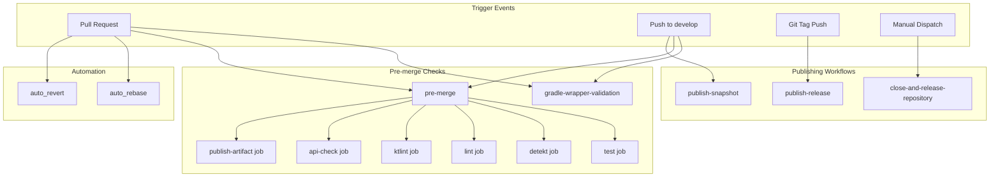
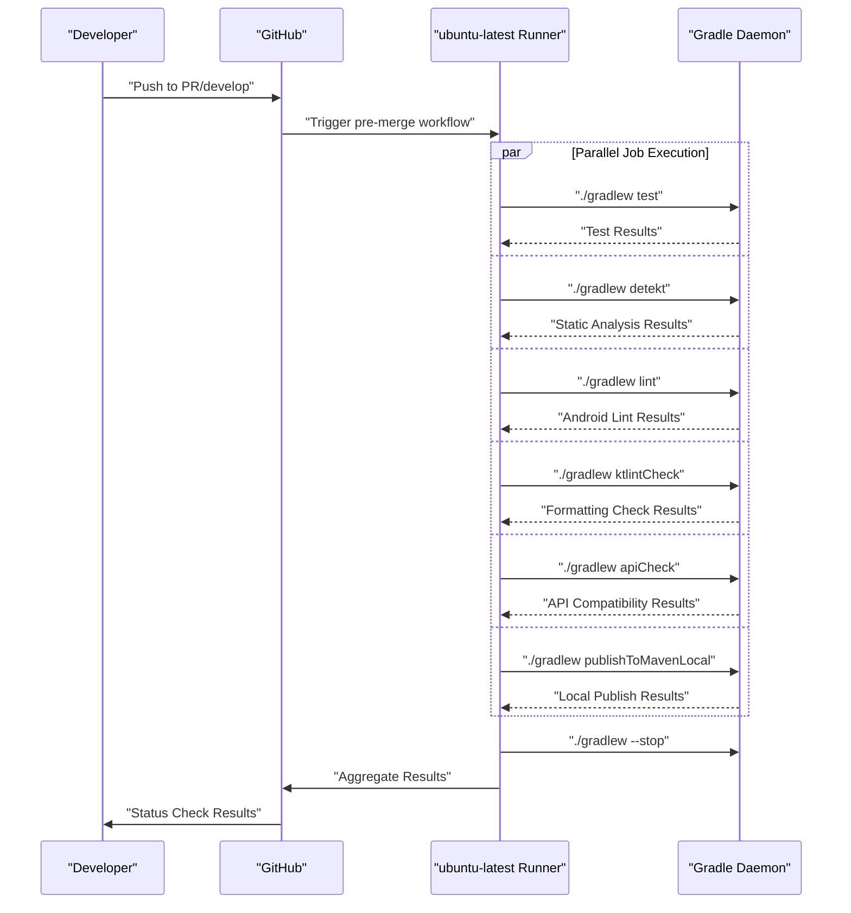
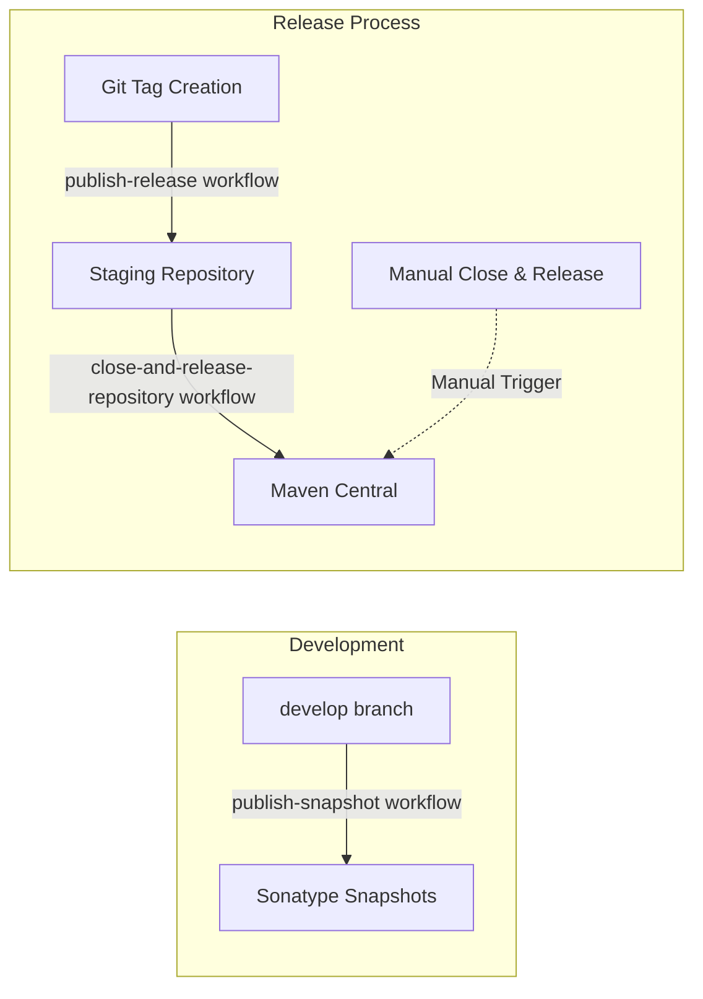

# CI/CD Pipeline

<details>
<summary>Relevant source files</summary>

The following files were used as context for generating this wiki page:

- [.github/workflows/auto_rebase.yaml](.github/workflows/auto_rebase.yaml)
- [.github/workflows/auto_revert.yaml](.github/workflows/auto_revert.yaml)
- [.github/workflows/close-and-release-repository.yaml](.github/workflows/close-and-release-repository.yaml)
- [.github/workflows/gradle-wrapper-validation.yml](.github/workflows/gradle-wrapper-validation.yml)
- [.github/workflows/pre-merge.yaml](.github/workflows/pre-merge.yaml)
- [.github/workflows/publish-release.yaml](.github/workflows/publish-release.yaml)
- [.github/workflows/publish-snapshot.yaml](.github/workflows/publish-snapshot.yaml)

</details>


This document describes Chucker's automated testing, quality assurance, publishing, and deployment processes. The CI/CD pipeline ensures code quality through multiple validation stages and automates the distribution of library artifacts to Maven Central.

For information about the Gradle build configuration and artifact publishing setup, see [Build System](#6.1). For details about the development workflow and contribution guidelines, see [Contributing](#6.3).

## Pipeline Overview

Chucker's CI/CD pipeline is implemented using GitHub Actions and consists of multiple workflows that handle different aspects of the development and release process. The pipeline supports both development snapshots and production releases while maintaining strict quality gates.

### Workflow Architecture



Sources: [.github/workflows/pre-merge.yaml:1-162](), [.github/workflows/publish-snapshot.yaml:1-39](), [.github/workflows/publish-release.yaml:1-35](), [.github/workflows/gradle-wrapper-validation.yml:1-23]()

## Pre-merge Quality Gates

The `pre-merge` workflow enforces code quality standards before any changes are merged into the main development branch. This workflow runs on every pull request and push to the `develop` branch.

### Quality Check Jobs

| Job Name | Purpose | Gradle Task | Failure Impact |
|----------|---------|-------------|----------------|
| `test` | Unit test execution | `./gradlew test` | Blocks merge |
| `detekt` | Static code analysis | `./gradlew detekt` | Blocks merge |  
| `lint` | Android lint checks | `./gradlew lint` | Blocks merge |
| `ktlint` | Kotlin code formatting | `./gradlew ktlintCheck` | Blocks merge |
| `api-check` | Binary compatibility | `./gradlew apiCheck` | Blocks merge |
| `publish-artifact` | Local publishing test | `./gradlew publishToMavenLocal` | Informational |

### Workflow Execution Flow



Sources: [.github/workflows/pre-merge.yaml:13-162]()

## Publishing Workflows

Chucker maintains separate publishing pipelines for development snapshots and production releases, each with different triggers and repository targets.

### Snapshot Publishing

The `publish-snapshot` workflow automatically publishes development artifacts when changes are merged to the `develop` branch.

**Trigger:** Push to `develop` branch
**Repository:** Sonatype Snapshot Repository  
**Gradle Tasks:**
- `./gradlew publishToMavenLocal` - Local verification
- `./gradlew publishReleasePublicationToSnapshotRepository` - Remote publish

### Release Publishing  

The `publish-release` workflow publishes production artifacts when a git tag is created.

**Trigger:** Git tag push (any tag pattern)
**Repository:** Sonatype Staging Repository
**Gradle Tasks:**
- `./gradlew publishToMavenLocal` - Local verification  
- `./gradlew publishReleasePublicationToStagingRepository` - Staging publish

### Release Process Flow



Sources: [.github/workflows/publish-snapshot.yaml:1-39](), [.github/workflows/publish-release.yaml:1-35](), [.github/workflows/close-and-release-repository.yaml:1-17]()

## Gradle Integration

All CI/CD workflows integrate with Chucker's Gradle build system through specific tasks and configurations defined in the build scripts.

### Cache Strategy

Each workflow implements Gradle caching to optimize build performance:

```yaml
- name: Cache Gradle Folders
  uses: actions/cache@v2
  with:
    path: |
      ~/.gradle/caches/
      ~/.gradle/wrapper/
    key: cache-gradle-${{ hashFiles('build.gradle') }}
    restore-keys: cache-gradle-
```

### Secret Management

Publishing workflows require the following GitHub Secrets:

| Secret Name | Purpose | Usage |
|-------------|---------|--------|
| `ORG_GRADLE_PROJECT_SIGNING_KEY` | Artifact signing | All publishing workflows |
| `ORG_GRADLE_PROJECT_SIGNING_PWD` | Signing key password | All publishing workflows |  
| `ORG_GRADLE_PROJECT_NEXUS_USERNAME` | Sonatype credentials | Snapshot/release publishing |
| `ORG_GRADLE_PROJECT_NEXUS_PASSWORD` | Sonatype credentials | Snapshot/release publishing |

Sources: [.github/workflows/pre-merge.yaml:27-36](), [.github/workflows/publish-snapshot.yaml:23-39](), [.github/workflows/publish-release.yaml:18-34]()

## Automation Workflows

Chucker includes additional automation workflows to streamline development maintenance tasks.

### Automatic Rebase

The `auto_rebase` workflow allows maintainers to trigger pull request rebases through issue comments.

**Trigger:** Issue comment containing `/rebase`
**Action:** Automatically rebases the pull request branch
**Implementation:** Uses `cirrus-actions/rebase@1.5`

### Automatic Revert

The `auto_revert` workflow enables quick reversion of problematic commits.

**Trigger:** Issue comment containing `/revert`  
**Action:** Creates revert commit for specified changes
**Implementation:** Uses `srt32/revert@v0.0.1`

### Security and Access Control

Both automation workflows include repository ownership validation:

```yaml
if: ${{ github.repository == 'ChuckerTeam/chucker'}}
```

This prevents workflows from running on forks, maintaining security for automated operations.

Sources: [.github/workflows/auto_rebase.yaml:1-27](), [.github/workflows/auto_revert.yaml:1-17]()

## Validation and Security

### Gradle Wrapper Validation

The `gradle-wrapper-validation` workflow ensures the integrity of the Gradle wrapper JAR file, preventing potential security vulnerabilities from tampered build tools.

**Trigger:** All pushes and pull requests
**Validation:** Uses `gradle/wrapper-validation-action@v1`
**Purpose:** Cryptographic verification of `gradle-wrapper.jar`

### Build Isolation

All workflows run on fresh `ubuntu-latest` runners with no persistent state between executions, ensuring reproducible builds and preventing cross-contamination between different builds.

### Artifact Upload

Build artifacts are preserved for debugging and verification purposes:

- **Pre-merge:** Local Maven repository artifacts uploaded as `chucker-local-artifacts`
- **Snapshot:** Snapshot artifacts uploaded as `chucker-snapshot-artifacts`  
- **Release:** Release artifacts uploaded as `chucker-release-artifacts`

Sources: [.github/workflows/gradle-wrapper-validation.yml:1-23](), [.github/workflows/pre-merge.yaml:154-161](), [.github/workflows/publish-snapshot.yaml:27-31]()
