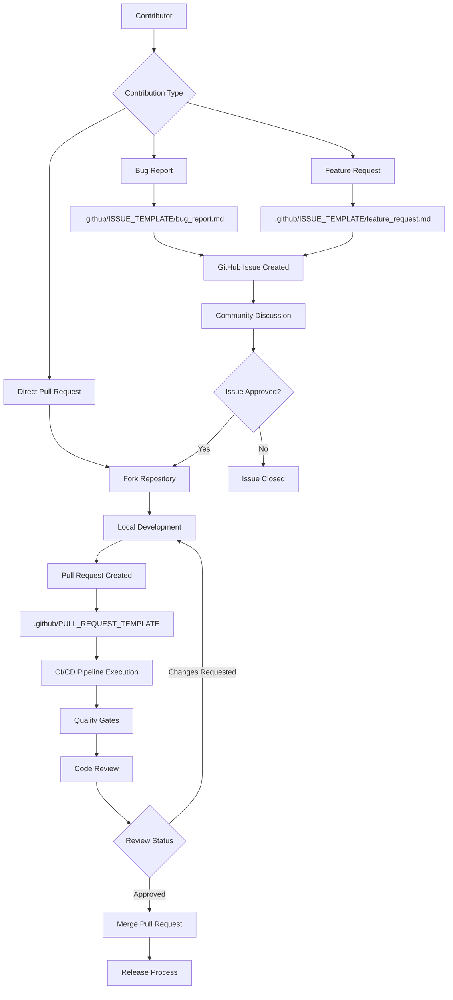
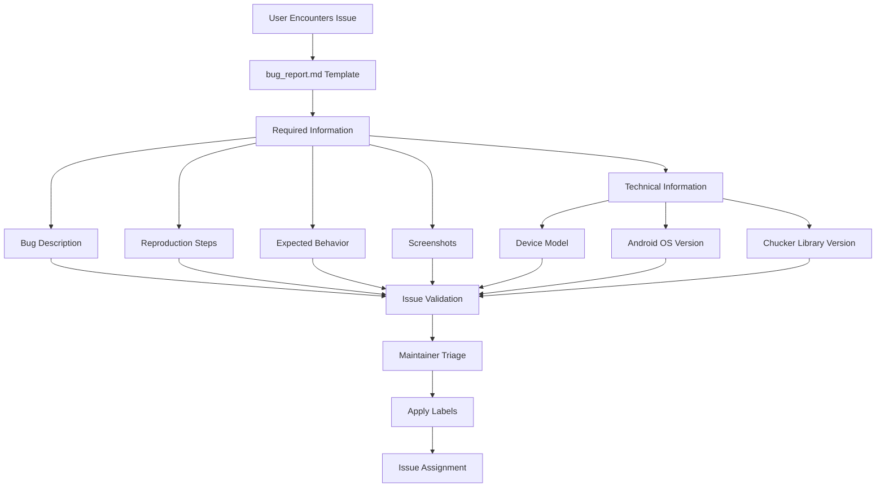
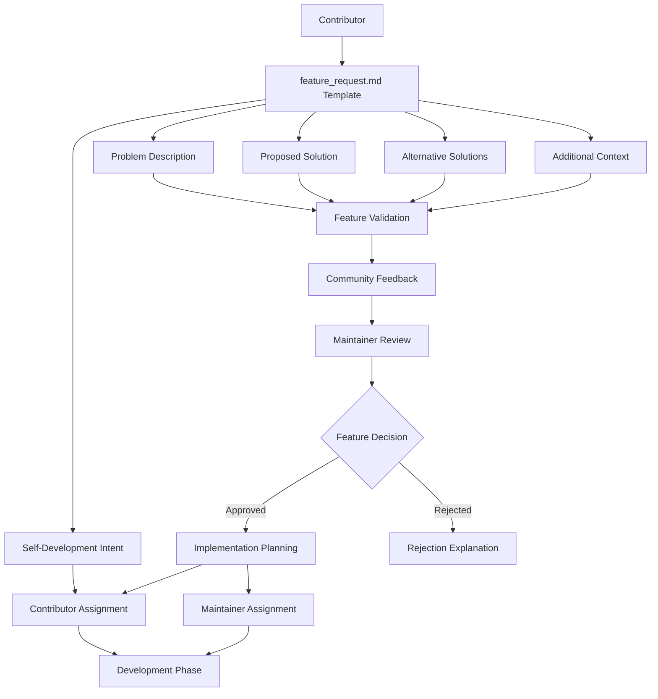
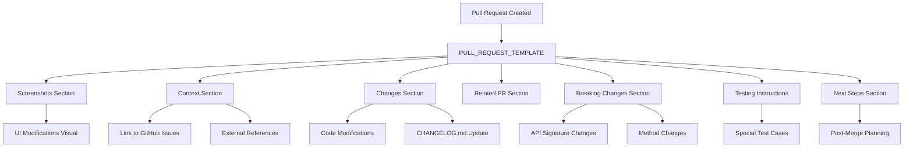
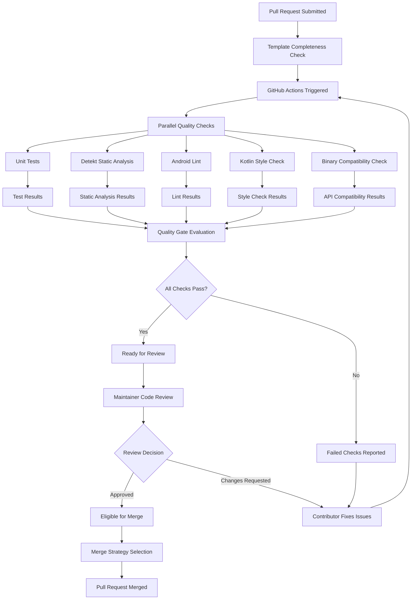
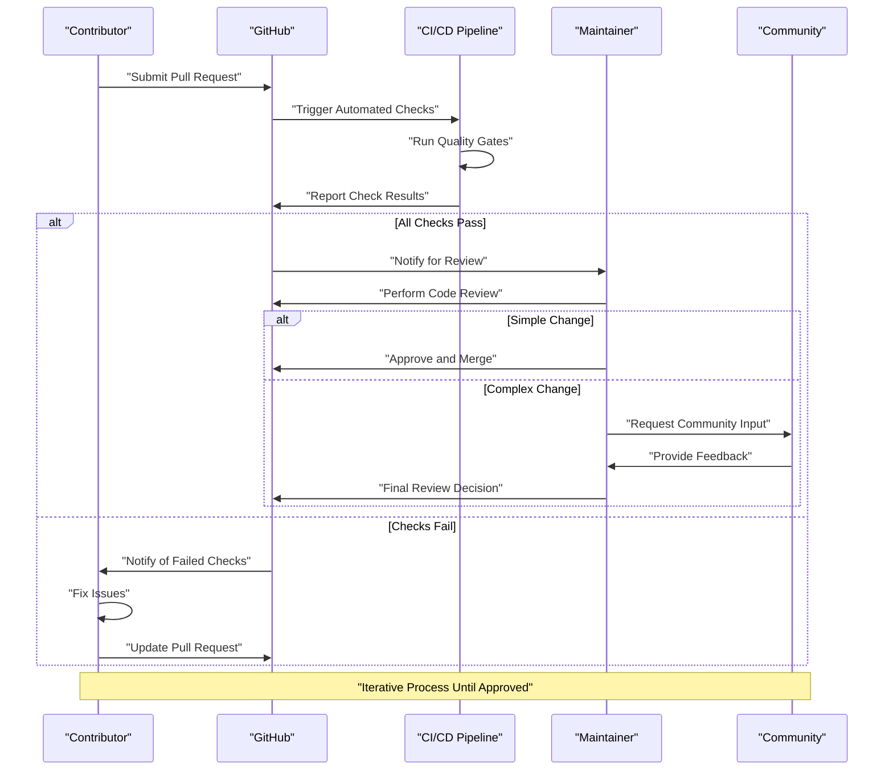
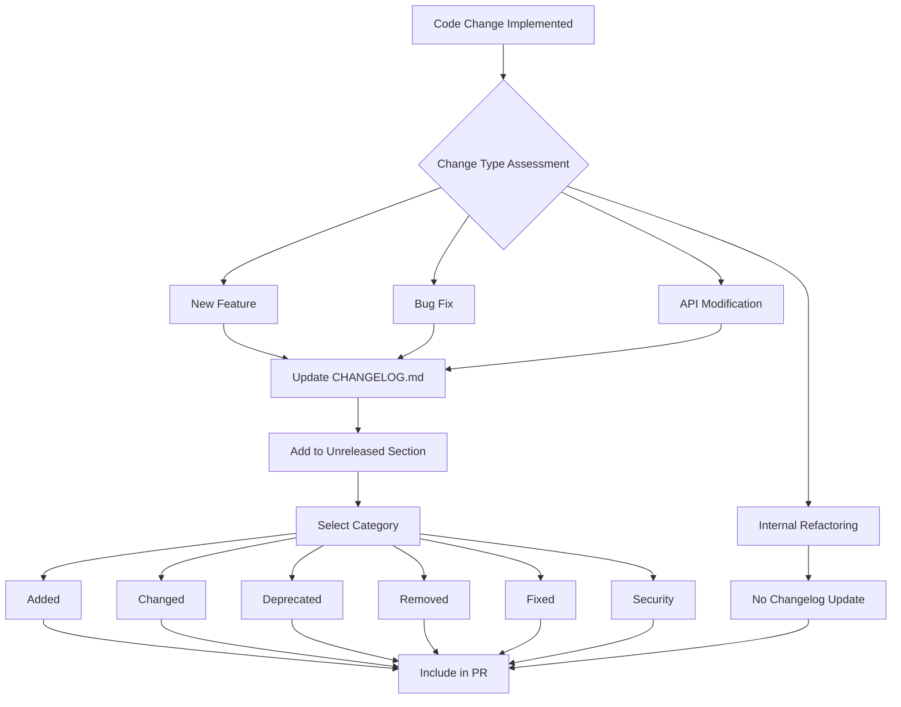

# Contributing

Relevant source files

The following files were used as context for generating this wiki page:

- [.github/ISSUE_TEMPLATE/bug_report.md](.github/ISSUE_TEMPLATE/bug_report.md)
- [.github/ISSUE_TEMPLATE/feature_request.md](.github/ISSUE_TEMPLATE/feature_request.md)
- [.github/PULL_REQUEST_TEMPLATE](.github/PULL_REQUEST_TEMPLATE)

This document provides comprehensive guidelines for contributing to the Chucker HTTP inspection library. It covers the development workflow, issue reporting processes, pull request procedures, and quality standards expected from contributors.

For information about the build system setup, see [Build System](#6.1). For details about automated testing and CI/CD processes, see [CI/CD Pipeline](#6.2).

## Contribution Workflow Overview

The Chucker project follows a structured contribution model that integrates with the build system and automated quality gates to ensure code quality and project stability.

### Overall Contribution Process

Sources: [.github/PULL_REQUEST_TEMPLATE](), [.github/ISSUE_TEMPLATE/bug_report.md](), [.github/ISSUE_TEMPLATE/feature_request.md]()

## Issue Reporting Process

Chucker uses structured issue templates to ensure consistent and actionable bug reports and feature requests.

### Bug Reporting Workflow

| Field | Purpose | Required |
|-------|---------|----------|
| Bug Description | Clear explanation of the issue | Yes |
| Reproduction Steps | Step-by-step instructions to reproduce | Yes |
| Expected Behavior | What should happen instead | Yes |
| Screenshots | Visual evidence of the issue | Optional |
| Device | Specific device model | Yes |
| OS Version | Android version | Yes |
| Chucker Version | Library version number | Yes |

Sources: [.github/ISSUE_TEMPLATE/bug_report.md:7-29]()

### Feature Request Process

Sources: [.github/ISSUE_TEMPLATE/feature_request.md:7-22]()

## Pull Request Process

The pull request workflow ensures code quality through structured templates and automated validation.

### Pull Request Template Structure

| Section | Purpose | Required |
|---------|---------|----------|
| Screenshots | Visual demonstration of changes | For UI changes |
| Context | Explanation and issue linking | Yes |
| Changes | Code modifications description | Yes |
| Related PR | Dependencies and blocking PRs | If applicable |
| Breaking | API compatibility impact | If applicable |
| Testing | Special testing requirements | If complex |
| Next Steps | Post-merge planning | If applicable |

Sources: [.github/PULL_REQUEST_TEMPLATE:1-22]()

### Pull Request Validation Flow

Sources: [.github/PULL_REQUEST_TEMPLATE:9]()

## Development Workflow Integration

The contribution process integrates with Chucker's modular architecture and build system to maintain code quality across all components.

### Repository Structure and Contribution Areas

```mermaid
flowchart TD
    CHUCKER_REPO["ChuckerTeam/chucker Repository"] --> MODULE_AREAS["Contribution Areas"]
    
    MODULE_AREAS --> LIBRARY_MODULE["library/ Module"]
    MODULE_AREAS --> NOOP_MODULE["library-no-op/ Module"]
    MODULE_AREAS --> SAMPLE_MODULE["sample/ Module"]
    MODULE_AREAS --> BUILD_SYSTEM["Build System Files"]
    MODULE_AREAS --> CI_CONFIG["CI/CD Configuration"]
    MODULE_AREAS --> DOCUMENTATION["Documentation"]
    
    LIBRARY_MODULE --> CORE_API["Core API Components"]
    LIBRARY_MODULE --> INTERCEPTOR["ChuckerInterceptor"]
    LIBRARY_MODULE --> COLLECTOR["ChuckerCollector"]
    LIBRARY_MODULE --> UI_COMPONENTS["UI Activities & Fragments"]
    LIBRARY_MODULE --> DATA_LAYER["Data Repository & DAO"]
    
    NOOP_MODULE --> STUB_IMPL["Stub Implementations"]
    
    SAMPLE_MODULE --> DEMO_APP["Demo Application"]
    SAMPLE_MODULE --> INTEGRATION_EXAMPLES["Integration Examples"]
    
    BUILD_SYSTEM --> GRADLE_FILES["Gradle Build Scripts"]
    BUILD_SYSTEM --> PUBLISHING_CONFIG["Publishing Configuration"]
    
    CI_CONFIG --> GITHUB_ACTIONS["GitHub Actions Workflows"]
    CI_CONFIG --> QUALITY_CHECKS["Quality Check Definitions"]
    
    DOCUMENTATION --> README["README.md"]
    DOCUMENTATION --> CHANGELOG["CHANGELOG.md"]
    DOCUMENTATION --> ISSUE_TEMPLATES["Issue Templates"]
    DOCUMENTATION --> PR_TEMPLATE["PR Template"]
```

### Contribution Impact Assessment

| Component | Impact Level | Review Requirements |
|-----------|--------------|-------------------|
| `library/` Core API | High | Maintainer + Community Review |
| `library/` UI Components | Medium | Maintainer Review + Screenshots |
| `library-no-op/` Stubs | High | API Compatibility Check |
| `sample/` Demo App | Low | Basic Review |
| Build System | High | Build System Expert Review |
| CI/CD Configuration | High | Maintainer Review |
| Documentation | Low | Community Review |

Sources: [.github/PULL_REQUEST_TEMPLATE:14-15]()

## Code Review and Quality Standards

The project maintains high code quality through structured review processes and automated quality gates.

### Review Process Flow

### Quality Gate Requirements

| Check Type | Tool/Process | Failure Impact |
|------------|--------------|----------------|
| Unit Tests | JUnit | Blocks merge |
| Static Analysis | Detekt | Blocks merge |
| Code Style | ktlint | Blocks merge |
| Android Lint | Android Lint | Blocks merge |
| API Compatibility | Binary Compatibility Validator | Blocks merge |
| Manual Review | Maintainer Review | Blocks merge |

Sources: [.github/PULL_REQUEST_TEMPLATE:17-18]()

## Changelog and Release Integration

Contributors must update the changelog for user-facing changes to ensure proper release documentation.

### Changelog Update Process

Sources: [.github/PULL_REQUEST_TEMPLATE:9]()
