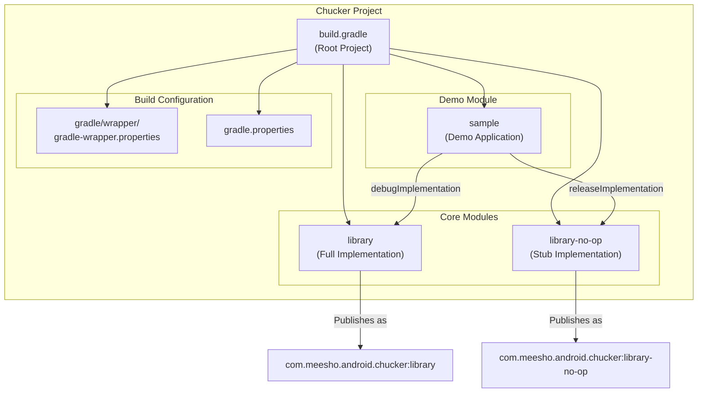
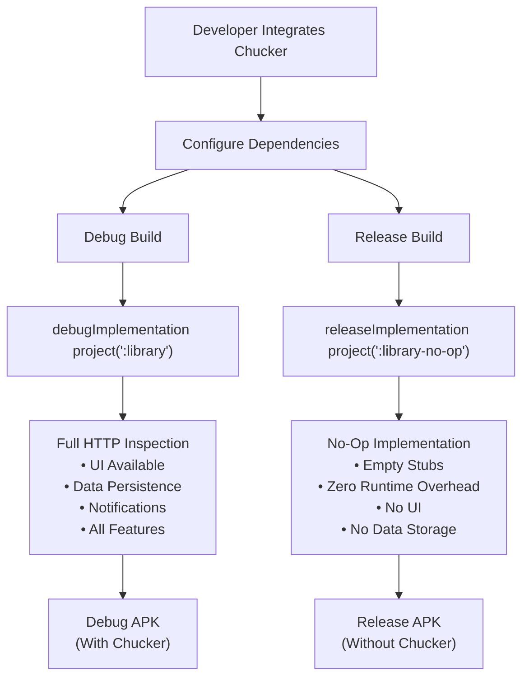
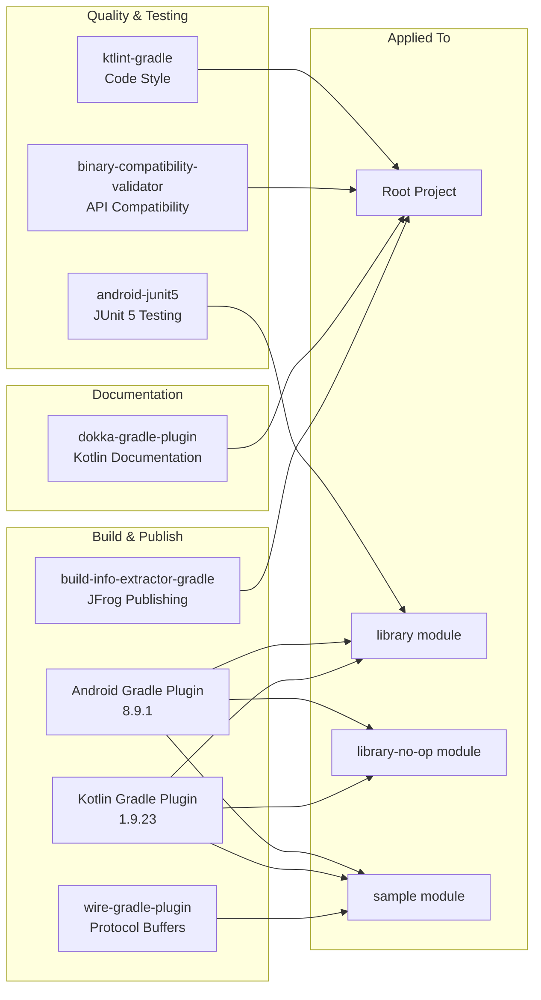
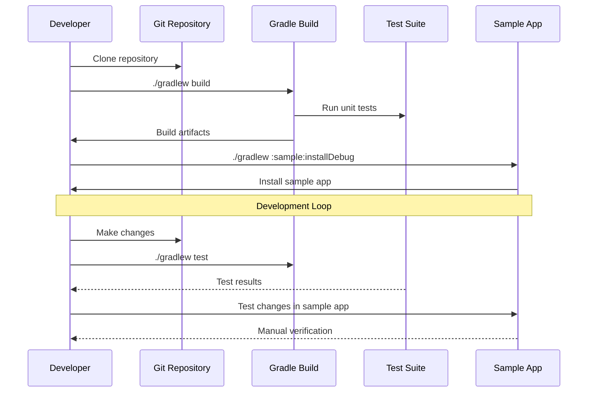

# Development

<details>
<summary>Relevant source files</summary>

The following files were used as context for generating this wiki page:

- [build.gradle](build.gradle)
- [gradle/wrapper/gradle-wrapper.properties](gradle/wrapper/gradle-wrapper.properties)
- [library-no-op/build.gradle](library-no-op/build.gradle)
- [library/build.gradle](library/build.gradle)
- [library/src/main/kotlin/com/chuckerteam/chucker/internal/ui/BaseChuckerActivity.kt](library/src/main/kotlin/com/chuckerteam/chucker/internal/ui/BaseChuckerActivity.kt)
- [sample/build.gradle](sample/build.gradle)
- [sample/src/main/kotlin/com/chuckerteam/chucker/sample/MainActivity.kt](sample/src/main/kotlin/com/chuckerteam/chucker/sample/MainActivity.kt)

</details>


This page provides information for developers who want to contribute to or build Chucker itself. It covers the project structure, development environment setup, build system configuration, and development workflow.

For information about integrating Chucker into your application, see [Quick Start](#2). For details about the build system internals, see [Build System](#6.1). For CI/CD pipeline details, see [CI/CD Pipeline](#6.2). For contribution guidelines, see [Contributing](#6.3).

## Project Structure

Chucker uses a multi-module Gradle project structure with three main modules designed to provide flexibility for different build configurations.

### Module Architecture



Sources: [build.gradle:1-118](), [library/build.gradle:1-157](), [library-no-op/build.gradle:1-109](), [sample/build.gradle:1-85]()

The three-module architecture serves different purposes:

| Module | Purpose | Build Output | Dependencies |
|--------|---------|--------------|--------------|
| `library` | Full HTTP inspection functionality | `library-release.aar` | Room, Material, OkHttp, extensive Android dependencies |
| `library-no-op` | No-operation stubs for production builds | `library-no-op-release.aar` | Only OkHttp, minimal dependencies |
| `sample` | Demo application and development testing | `sample-debug.apk` / `sample-release.apk` | Uses `library` for debug, `library-no-op` for release |

### Key Build Configuration

The root [build.gradle:1-118]() defines shared configuration across all modules:

- **Kotlin Version**: `1.9.23` [build.gradle:3]()
- **Android Gradle Plugin**: `8.9.1` [build.gradle:4]()
- **Compile SDK**: `35` [build.gradle:115]()
- **Min SDK**: `21` [build.gradle:113]()
- **Target SDK**: `35` [build.gradle:114]()

## Development Environment Setup

### Prerequisites

1. **JDK 17**: Required for compilation [library/build.gradle:51-52]()
2. **Android SDK**: API level 35 for compilation
3. **Gradle**: Version 8.11.1 (via wrapper) [gradle/wrapper/gradle-wrapper.properties:4]()

### Build Variants Strategy



Sources: [sample/build.gradle:70-71]()

### Version Management

Both `library` and `library-no-op` modules use Git-based versioning:

```kotlin
ext.versionName = { ->
    def currentTag = 'git tag --points-at HEAD'.execute().in.text.toString().trim()
    def currentBranch = 'git rev-parse --abbrev-ref HEAD'.execute().in.text.toString().trim()
    def tagRegex = "[0-9.]*[0-9]"
    if (!currentTag.isEmpty() && currentTag.matches(tagRegex)) {
        return currentTag
    } else {
        return currentBranch + '-SNAPSHOT'
    }
}
```

- Tagged commits produce release versions (e.g., `3.5.2`)
- Branch commits produce snapshot versions (e.g., `develop-SNAPSHOT`)

Sources: [library/build.gradle:96-105](), [library-no-op/build.gradle:48-57]()

## Build System

### Gradle Plugin Configuration

The project uses several Gradle plugins for different aspects of development:



Sources: [build.gradle:52-61]()

### Publishing Configuration

Both library modules publish to JFrog Artifactory with the following configuration:

| Artifact | Group ID | Artifact ID | Repository |
|----------|----------|-------------|------------|
| Full library | `com.meesho.android.chucker` | `library` | Release/Snapshot repos based on version |
| No-op library | `com.meesho.android.chucker` | `library-no-op` | Release/Snapshot repos based on version |

Publishing includes:
- AAR file [library/build.gradle:123]()
- Sources JAR [library/build.gradle:110-113]()
- Generated POM with dependencies [library/build.gradle:126-134]()

Sources: [library/build.gradle:107-156](), [library-no-op/build.gradle:59-108]()

### Dependency Management

The root project centralizes dependency versions in `ext` block:

#### Core Dependencies
- **OkHttp**: `4.9.0` [build.gradle:22]()
- **Room**: `2.6.1` [build.gradle:12]()
- **Material Components**: `1.2.1` [build.gradle:11]()
- **Coroutines**: `1.7.3` [build.gradle:5]()

#### Development Dependencies  
- **JUnit 5**: `5.8.2` [build.gradle:36]()
- **MockK**: `1.10.2` [build.gradle:37]()
- **Truth**: `1.1` [build.gradle:39]()
- **Robolectric**: `4.4` [build.gradle:38]()

Sources: [build.gradle:2-44]()

## Development Workflow

### Local Development Setup



Sources: [sample/build.gradle:1-85](), [build.gradle:94-98]()

### Build Commands

Key Gradle tasks for development:

| Task | Purpose | Command |
|------|---------|---------|
| Build all | Compile and test all modules | `./gradlew build` |
| Run tests | Execute unit test suite | `./gradlew test` |
| Install sample | Install debug sample app | `./gradlew :sample:installDebug` |
| Lint checks | Code style validation | `./gradlew ktlintCheck` |
| API check | Binary compatibility validation | `./gradlew apiCheck` |
| Publish snapshot | Publish to snapshot repo | `./gradlew artifactoryPublish` |

### Quality Assurance

The build system enforces several quality gates:

#### Lint Configuration
- **Warnings as errors**: Enabled [library/build.gradle:33]()
- **Abort on error**: Enabled [library/build.gradle:34]()  
- **RTL disabled**: For consuming apps [library/build.gradle:36]()
- **Dependency warnings**: Disabled [library/build.gradle:38]()

#### Testing Configuration
- **JUnit 5**: Platform for unit tests [library/build.gradle:45]()
- **Android resources**: Included in unit tests [library/build.gradle:43]()
- **Test logging**: Events for skipped, failed, passed [build.gradle:95-97]()

Sources: [library/build.gradle:32-48](), [library-no-op/build.gradle:33-40](), [build.gradle:94-98]()

### Git Hooks

The build system automatically installs Git hooks:

```kotlin
task installGitHook(type: Copy) {
    from new File(rootProject.rootDir, 'pre-commit')
    into { new File(rootProject.rootDir, '.git/hooks') }
    fileMode 0777
}
```

The `clean` task depends on `installGitHook`, ensuring hooks are installed during development setup.

Sources: [build.gradle:101-110]()

### Sample Application Development

The `sample` module serves as both a demo and development testing environment:

#### Key Components
- **MainActivity**: Demonstrates Chucker integration patterns [sample/src/main/kotlin/com/chuckerteam/chucker/sample/MainActivity.kt:14-80]()
- **HTTP Tasks**: Various network request examples for testing
- **Build Variants**: Uses full library in debug, no-op in release [sample/build.gradle:70-71]()
- **Wire Integration**: Protocol buffer support [sample/build.gradle:3-7]()

#### Development Features
- **StrictMode**: Enabled for leak detection [sample/src/main/kotlin/com/chuckerteam/chucker/sample/MainActivity.kt:58-73]()
- **Direct Launch**: Button to open Chucker UI [sample/src/main/kotlin/com/chuckerteam/chucker/sample/MainActivity.kt:76-79]()
- **Interceptor Testing**: Toggle between application and network interceptors

Sources: [sample/build.gradle:1-85](), [sample/src/main/kotlin/com/chuckerteam/chucker/sample/MainActivity.kt:1-81]()
