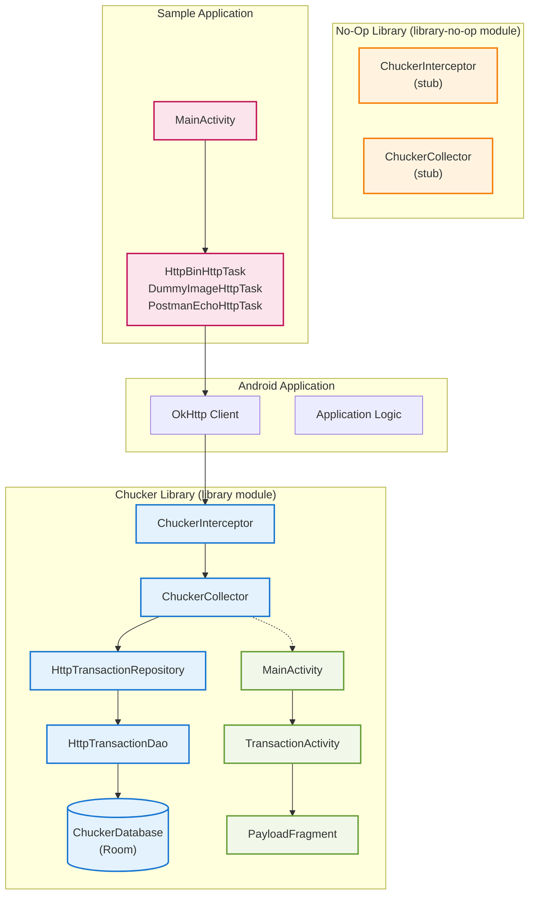
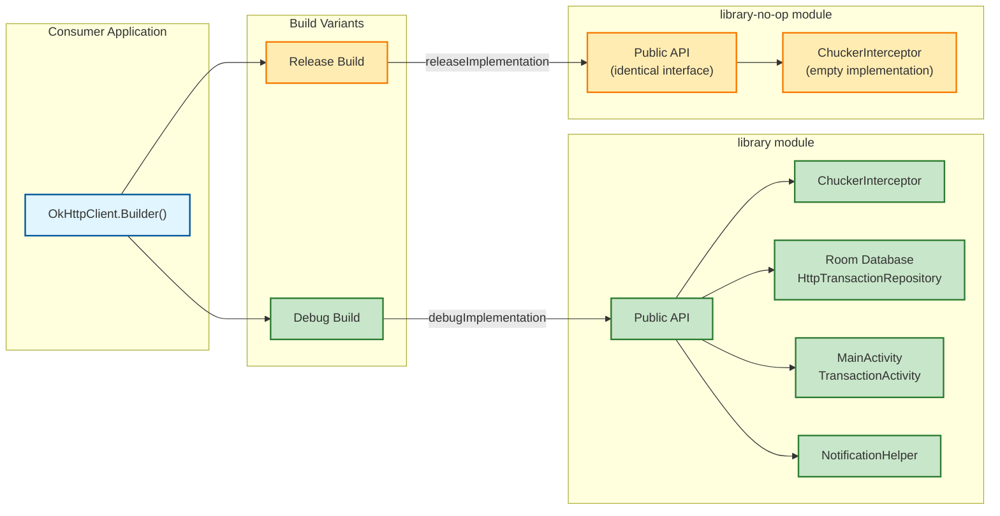
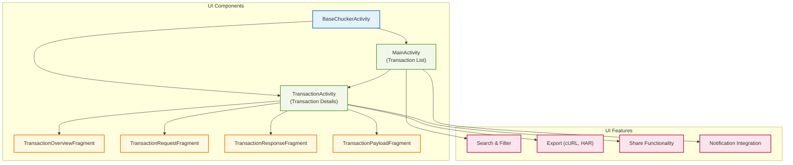
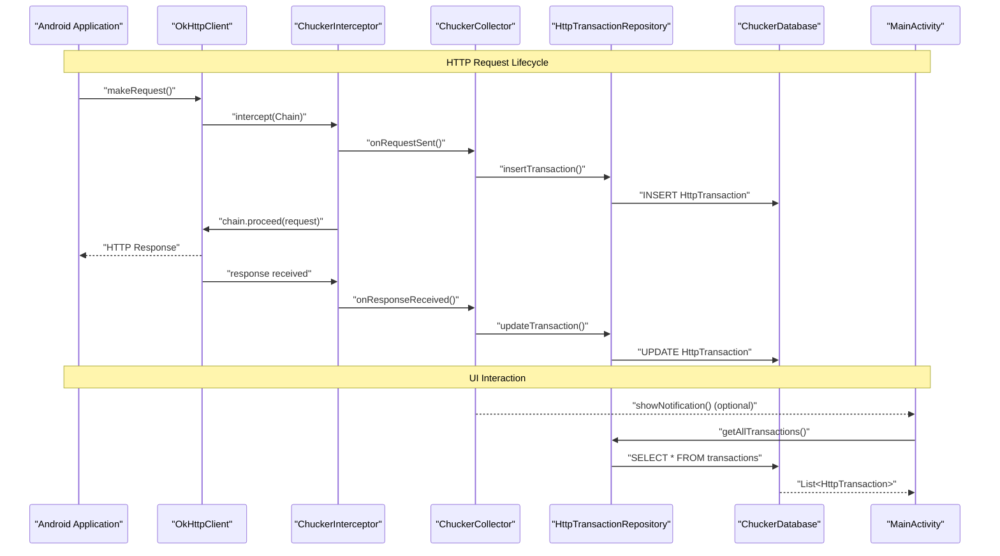

# Overview

<details>
<summary>Relevant source files</summary>

The following files were used as context for generating this wiki page:

- [CHANGELOG.md](CHANGELOG.md)
- [README.md](README.md)
- [build.gradle](build.gradle)
- [gradle.properties](gradle.properties)
- [gradle/wrapper/gradle-wrapper.properties](gradle/wrapper/gradle-wrapper.properties)
- [library-no-op/build.gradle](library-no-op/build.gradle)
- [library/build.gradle](library/build.gradle)
- [library/src/main/kotlin/com/chuckerteam/chucker/internal/ui/BaseChuckerActivity.kt](library/src/main/kotlin/com/chuckerteam/chucker/internal/ui/BaseChuckerActivity.kt)
- [sample/build.gradle](sample/build.gradle)
- [sample/src/main/kotlin/com/chuckerteam/chucker/sample/MainActivity.kt](sample/src/main/kotlin/com/chuckerteam/chucker/sample/MainActivity.kt)

</details>


This document provides a comprehensive overview of Chucker, an Android library for inspecting HTTP(S) requests and responses during application development. Chucker functions as an OkHttp interceptor that captures, persists, and displays network traffic through a dedicated user interface.

For detailed integration instructions, see [Quick Start](#2). For advanced configuration options, see [Advanced Configuration](#5). For information about the build system and contributing, see [Development](#6).

## Purpose and Scope

Chucker simplifies HTTP network debugging by providing real-time inspection capabilities for Android applications. The library captures all HTTP traffic processed through OkHttp clients and presents it in an organized, searchable interface. Key characteristics include:

- **Development-focused**: Designed for debug builds with zero overhead in release builds
- **OkHttp integration**: Works as a standard OkHttp interceptor
- **Persistent storage**: Uses Room database for transaction history
- **Rich UI**: Comprehensive viewing and sharing capabilities
- **Multi-module architecture**: Clean separation between full and no-op implementations

Sources: [README.md:24-26](), [README.md:32-67]()

## System Architecture Overview

Chucker employs a multi-layered architecture that separates concerns between network interception, data persistence, and user interface presentation.

### High-Level Component Relationships



Sources: [library/build.gradle:58-82](), [library-no-op/build.gradle:43-46](), [sample/build.gradle:69-84]()

### Module Architecture Strategy



Sources: [README.md:36-43](), [library/build.gradle:1-56](), [library-no-op/build.gradle:1-46]()

## Core Components

### Network Interception Layer

The `ChuckerInterceptor` serves as the primary entry point for HTTP traffic capture. It integrates with OkHttp's interceptor chain to observe requests and responses without disrupting normal network operations.

| Component | Location | Responsibility |
|-----------|----------|----------------|
| `ChuckerInterceptor` | `library/src/main/kotlin/com/chuckerteam/chucker/api/ChuckerInterceptor.kt` | OkHttp interceptor implementation |
| `ChuckerCollector` | `library/src/main/kotlin/com/chuckerteam/chucker/api/ChuckerCollector.kt` | Data collection and processing |
| `BodyDecoder` | `library/src/main/kotlin/com/chuckerteam/chucker/api/BodyDecoder.kt` | Custom body decoding interface |

Sources: [README.md:45-51](), [README.md:93-128]()

### Data Persistence Layer

Chucker uses Room database for persistent storage of HTTP transactions, enabling historical analysis and offline viewing.

```mermaid
graph TB
    subgraph "Data Layer Architecture"
        PUBLIC_API["Chucker object<br/>(Public API)"]
        REPO["HttpTransactionRepository"]
        DAO["HttpTransactionDao"]
        DB[("ChuckerDatabase")]
        ENTITY["HttpTransaction<br/>(Room Entity)")]
        
        PUBLIC_API --> REPO
        REPO --> DAO
        DAO --> DB
        DB --> ENTITY
    end
    
    subgraph "Configuration"
        RETENTION["RetentionManager"]
        PERIOD["RetentionManager.Period<br/>ONE_HOUR, ONE_DAY, etc."]
        
        RETENTION --> PERIOD
    end
    
    REPO --> RETENTION
    
    classDef data fill:#e8f5e8,stroke:#388e3c,stroke-width:2px
    classDef config fill:#fff3e0,stroke:#f57c00,stroke-width:2px
    
    class PUBLIC_API,REPO,DAO,DB,ENTITY data
    class RETENTION,PERIOD config
```

Sources: [library/build.gradle:69-71](), [README.md:97-103]()

### User Interface Layer

The UI system provides comprehensive transaction viewing and management capabilities through multiple interconnected activities and fragments.



Sources: [library/src/main/kotlin/com/chuckerteam/chucker/internal/ui/BaseChuckerActivity.kt:15-44](), [README.md:81-89]()

## Runtime Data Flow

The following sequence illustrates how HTTP transactions flow through Chucker's components during runtime execution:



Sources: [README.md:147-164](), [sample/src/main/kotlin/com/chuckerteam/chucker/sample/MainActivity.kt:76-79]()

## Build System Integration

Chucker's build system supports automated artifact publishing and quality assurance through multiple CI/CD workflows.

| Build Component | Purpose | Configuration |
|----------------|---------|---------------|
| Gradle Modules | Multi-module structure | [build.gradle:1-118]() |
| Artifact Publishing | Maven Central distribution | [library/build.gradle:115-156]() |
| Quality Gates | Code quality enforcement | [build.gradle:94-98]() |
| Version Management | Semantic versioning | [gradle.properties:20-23]() |

The system employs a dual-dependency strategy where debug builds include full functionality while release builds use no-op stubs, ensuring zero runtime overhead in production applications.

Sources: [build.gradle:64-99](), [library/build.gradle:115-156](), [library-no-op/build.gradle:67-108]()
