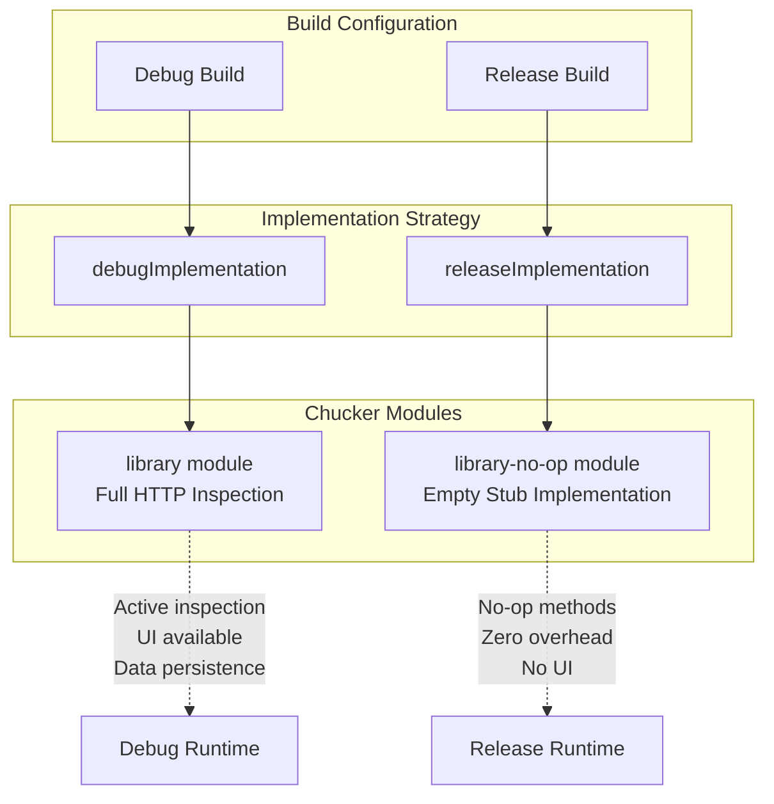
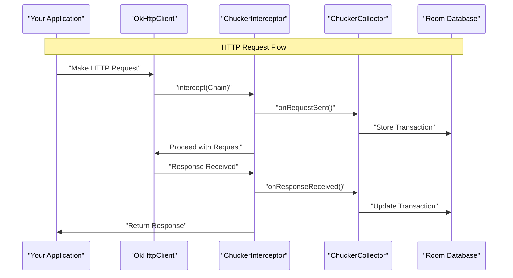
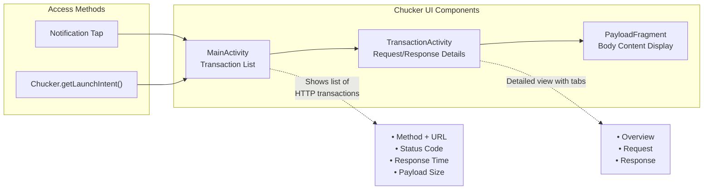

# Quick Start

<details>
<summary>Relevant source files</summary>

The following files were used as context for generating this wiki page:

- [CHANGELOG.md](CHANGELOG.md)
- [README.md](README.md)
- [gradle.properties](gradle.properties)

</details>


This document provides the essential steps to integrate Chucker into your Android application and start inspecting HTTP traffic. It covers dependency setup, basic OkHttp integration, and accessing the Chucker UI for the first time.

For advanced configuration options and customization, see [Advanced Configuration](#5). For detailed architecture information, see [Architecture](#3).

## Prerequisites

Before integrating Chucker, ensure your project meets these requirements:

| Requirement | Specification |
|-------------|---------------|
| **Android API Level** | 21 (Android 5.0) or higher |
| **OkHttp Version** | 4.x compatible |
| **Java Compatibility** | Java 8 support enabled |

**Java 8 Support Configuration:**

```groovy
android {
  compileOptions {
    sourceCompatibility JavaVersion.VERSION_1_8
    targetCompatibility JavaVersion.VERSION_1_8
  }
  
  // For Kotlin projects
  kotlinOptions.jvmTarget = "1.8"
}
```

Sources: [README.md:53-65]()

## Module Architecture

Chucker uses a dual-module strategy to ensure zero overhead in production builds:



Sources: [README.md:36-42]()

## Dependency Setup

Add both Chucker variants to your app module's `build.gradle` file:

```groovy
dependencies {
  debugImplementation "com.github.chuckerteam.chucker:library:3.5.2"
  releaseImplementation "com.github.chuckerteam.chucker:library-no-op:3.5.2"
}
```

This configuration ensures that:
- **Debug builds** include the full `ChuckerInterceptor` with UI and data persistence
- **Release builds** include only empty stub methods with zero runtime overhead

Sources: [README.md:38-42](), [gradle.properties:20-23]()

## Basic OkHttp Integration

Integrate Chucker by adding a `ChuckerInterceptor` to your OkHttp client:

```kotlin
val client = OkHttpClient.Builder()
    .addInterceptor(ChuckerInterceptor(context))
    .build()
```

### Integration Flow



Sources: [README.md:47-50]()

## Accessing the Chucker UI

Once integrated, Chucker provides multiple ways to access the HTTP inspection interface:

### Method 1: Notification Access

Chucker displays a persistent notification showing HTTP activity summary. Tap the notification to open the full UI.

### Method 2: Programmatic Access

Launch Chucker UI directly from your application:

```kotlin
val intent = Chucker.getLaunchIntent(context)
startActivity(intent)
```

### UI Access Flow



Sources: [README.md:24-26]()

## Verification

After integration, verify Chucker is working correctly:

1. **Build and run** your application in debug mode
2. **Make HTTP requests** using your OkHttp client
3. **Check for notification** showing HTTP activity summary
4. **Tap notification** or use `Chucker.getLaunchIntent()` to open the UI
5. **Verify transactions appear** in the transaction list with request/response details

### Expected Behavior

| Build Type | Expected Behavior |
|------------|-------------------|
| **Debug** | • Notification appears<br/>• UI accessible<br/>• HTTP transactions logged<br/>• Request/response details available |
| **Release** | • No notification<br/>• No UI available<br/>• Zero performance impact<br/>• No data storage |

Sources: [README.md:67](), [README.md:76-80]()

## Key Classes Reference

The following core classes handle HTTP interception and data management:

| Class | Purpose | Location |
|-------|---------|----------|
| `ChuckerInterceptor` | OkHttp interceptor for HTTP capture | Main integration point |
| `ChuckerCollector` | Data collection and notification management | Configuration and customization |
| `MainActivity` | Transaction list UI | UI entry point |
| `TransactionActivity` | Individual transaction details | Detailed HTTP inspection |

For advanced configuration of these classes, see [Advanced Configuration](#5).

Sources: [README.md:45-50](), [README.md:93-128]()

## Next Steps

- **Explore the UI**: Navigate through transaction details, request/response bodies, and overview information
- **Advanced Configuration**: Configure collectors, decoders, and security settings in [Advanced Configuration](#5)
- **Custom Integration**: Review the sample application patterns in [Sample Application](#5.2)
- **UI Customization**: Learn about themes and styling in [Styling and Theming](#4.3)

Sources: [README.md:91-128]()
