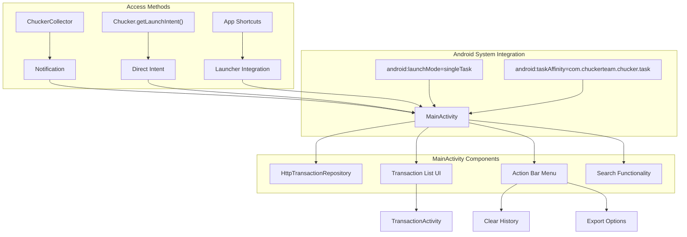
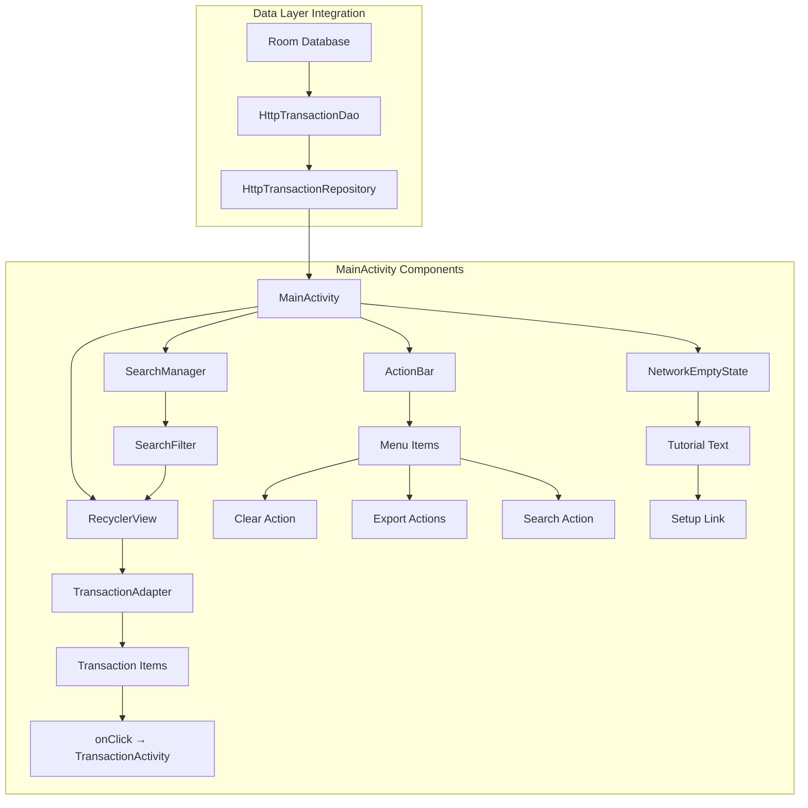
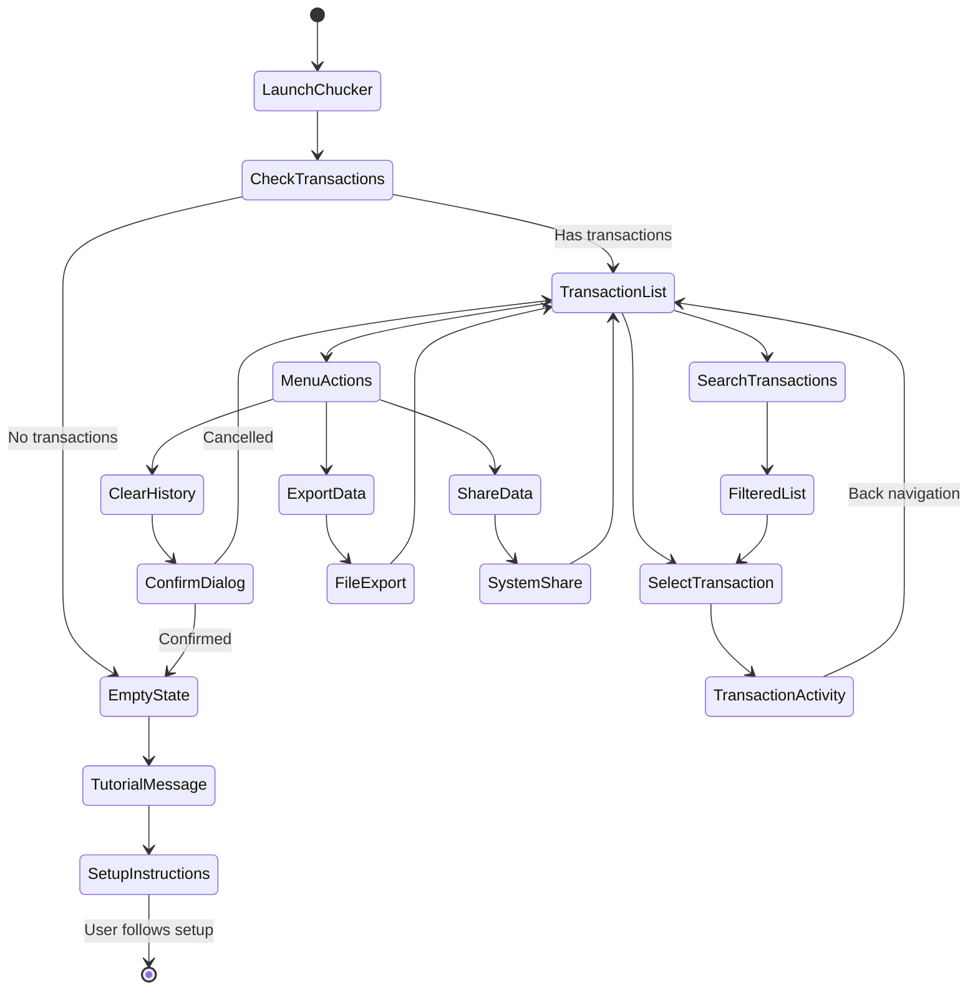

# Main Interface

<details>
<summary>Relevant source files</summary>

The following files were used as context for generating this wiki page:

- [library/src/main/AndroidManifest.xml](library/src/main/AndroidManifest.xml)
- [library/src/main/res/values/strings.xml](library/src/main/res/values/strings.xml)

</details>


This page covers the main Chucker user interface components and navigation patterns, focusing on the primary entry points and the `MainActivity` that serves as the central hub for HTTP transaction inspection. For detailed transaction viewing capabilities, see [Transaction Details](#4.2). For UI customization and styling options, see [Styling and Theming](#4.3).

## Purpose and Architecture Overview

The Chucker main interface provides developers with an intuitive way to browse and inspect HTTP transactions captured by the `ChuckerInterceptor`. The UI is implemented as a set of Android Activities and follows Material Design principles, with `MainActivity` serving as the primary entry point for viewing the list of captured HTTP transactions.

## Entry Points and Launch Methods

Chucker provides several ways for developers to access the main interface during application runtime:

### Notification Access
When configured with `showNotification = true`, Chucker displays a persistent notification that allows direct access to the UI by tapping the notification.

### Programmatic Launch
Developers can launch Chucker programmatically using the public API:
```kotlin
val intent = Chucker.getLaunchIntent(context)
startActivity(intent)
```

### Application Shortcuts
Chucker registers an application shortcut for quick access from the device's launcher or app info screen.

**Entry Points Architecture**


Sources: [library/src/main/AndroidManifest.xml:15-20](), [library/src/main/res/values/strings.xml:60]()

## MainActivity Structure

The `MainActivity` is declared in the Android manifest with specific configuration for optimal user experience:

### Activity Configuration
| Property | Value | Purpose |
|----------|-------|---------|
| `android:name` | `com.chuckerteam.chucker.internal.ui.MainActivity` | Main activity class |
| `android:label` | `@string/chucker_name` ("Chucker") | Display name in task switcher |
| `android:launchMode` | `singleTask` | Ensures single instance across app |
| `android:taskAffinity` | `com.chuckerteam.chucker.task` | Separate task stack |
| `android:theme` | `@style/Chucker.Theme` | Consistent UI theming |

The `singleTask` launch mode ensures that only one instance of Chucker's UI exists at any time, preventing multiple overlapping instances when accessed from different parts of an application.

**MainActivity Component Structure**


Sources: [library/src/main/AndroidManifest.xml:15-20]()

## User Interface Elements

### Transaction List Display
The main interface displays HTTP transactions in a scrollable list format, with each item showing:

- HTTP method and URL
- Response status code and timing
- Request/response size information
- Timestamp of the transaction

### Action Bar Menu
The action bar provides several key functions accessible through menu items:

| Menu Item | String Resource | Functionality |
|-----------|----------------|---------------|
| Search | `chucker_search` | Filter transactions |
| Clear | `chucker_clear` | Remove all transaction history |
| Export | `chucker_export` | Export data as text or HAR |
| Share | `chucker_share` | Share transaction data |

### Empty State Handling
When no HTTP transactions have been captured, the interface displays a tutorial message with setup instructions:

- Tutorial text explaining the need for `ChuckerInterceptor`
- Link to GitHub setup documentation
- Encouragement to add the interceptor to OkHttp client

**User Interaction Flow**


Sources: [library/src/main/res/values/strings.xml:42](), [library/src/main/res/values/strings.xml:48-50](), [library/src/main/res/values/strings.xml:54-55]()

## Navigation and Activity Relationships

### Parent-Child Activity Structure
The UI follows Android's standard navigation patterns:

- `MainActivity` serves as the parent activity for the transaction list
- `TransactionActivity` is declared with `parentActivityName` pointing to `MainActivity`
- Standard back navigation returns users to the transaction list

### Task Affinity and Launch Behavior
The custom task affinity (`com.chuckerteam.chucker.task`) ensures that Chucker's UI appears in its own task stack, separate from the host application. This provides:

- Clean separation from the host app's navigation stack
- Consistent behavior when launching from notifications
- Proper handling in Android's recent apps view

### Intent Filters and System Integration
The manifest configuration supports:

- File creation intents for export functionality
- Wake lock permissions for background operations
- File provider integration for sharing transaction data

Sources: [library/src/main/AndroidManifest.xml:18-19](), [library/src/main/AndroidManifest.xml:22-25]()

## Supporting Android Components

### Services and Background Operations
The main interface integrates with several background services:

- `ClearDatabaseService`: Handles database cleanup operations
- `ClearDatabaseJobIntentServiceReceiver`: Processes cleanup requests

### File Provider Integration
The `ChuckerFileProvider` enables secure file sharing for export functionality:
- Authority: `${applicationId}.com.chuckerteam.chucker.provider`
- Supports sharing transaction data as files
- Enables export to external storage

### Permission Requirements
The interface requires minimal permissions:
- `WAKE_LOCK`: For background database operations
- File access: Handled through the system's document picker

Sources: [library/src/main/AndroidManifest.xml:27-44](), [library/src/main/AndroidManifest.xml:12]()
