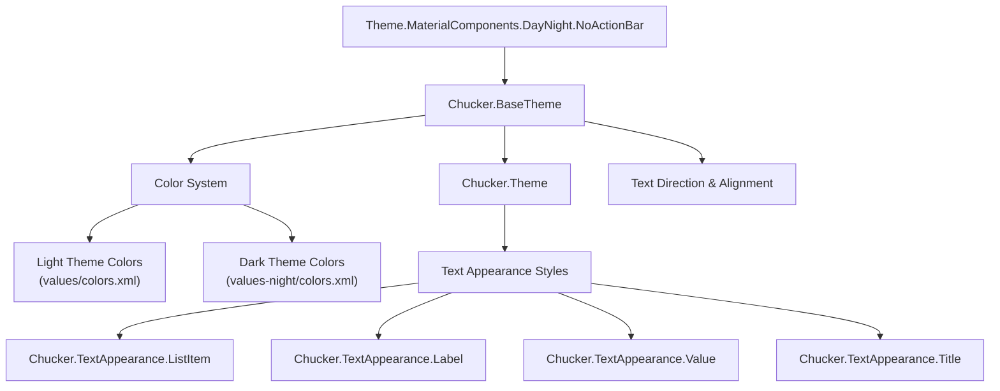
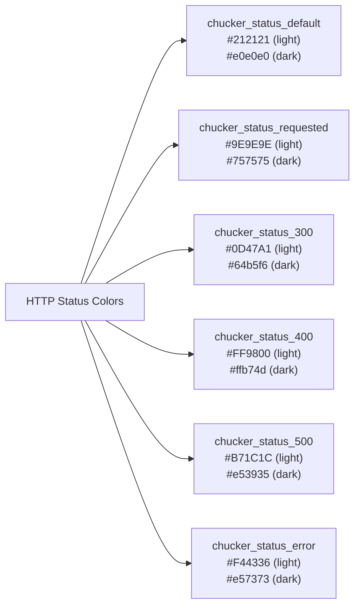
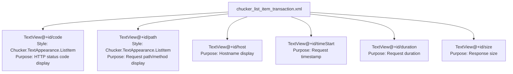

# Styling and Theming

Relevant source files

The following files were used as context for generating this wiki page:

- [library/src/main/res/layout/chucker_list_item_transaction.xml](library/src/main/res/layout/chucker_list_item_transaction.xml)
- [library/src/main/res/values-night/colors.xml](library/src/main/res/values-night/colors.xml)
- [library/src/main/res/values/colors.xml](library/src/main/res/values/colors.xml)
- [library/src/main/res/values/styles.xml](library/src/main/res/values/styles.xml)

This document covers Chucker's theming and styling system, including the Material Design theme implementation, color schemes, and text appearance styles. The styling system provides consistent visual design across all Chucker UI components and supports both light and dark themes.

For information about the specific UI components that use these styles, see [Main Interface](#4.1) and [Transaction Details](#4.2).

## Theme Architecture

Chucker uses a hierarchical theming system built on Material Components for Android. The theme structure follows Material Design principles while providing custom colors and styling specific to network inspection requirements.

### Theme Hierarchy

Sources: [library/src/main/res/values/styles.xml:4-21]()

The base theme `Chucker.BaseTheme` extends `Theme.MaterialComponents.DayNight.NoActionBar` and defines all core theming attributes. The main application theme `Chucker.Theme` inherits from the base theme without modifications, providing a clean extension point for future customization.

Sources: [library/src/main/res/values/styles.xml:4-21]()

## Color System

Chucker implements a comprehensive color system that supports both light and dark themes through Android's automatic theme switching mechanism.

### Light Theme Colors

The light theme uses a blue primary color scheme with high contrast text colors:

| Color Role | Value | Usage |
|------------|-------|--------|
| `chucker_color_primary` | `#01579b` | Primary brand color, action buttons |
| `chucker_color_primary_variant` | `#002f6c` | Darker primary variant |
| `chucker_color_secondary` | `#009E09` | Secondary actions, success states |
| `chucker_color_background` | `#ffffff` | Main background surface |
| `chucker_color_surface` | `#ffffff` | Card and component surfaces |
| `chucker_color_error` | `#F44336` | Error states and messages |

Sources: [library/src/main/res/values/colors.xml:3-13]()

### Dark Theme Colors

The dark theme automatically activates based on system settings and provides appropriate color adaptations:

| Color Role | Value | Usage |
|------------|-------|--------|
| `chucker_color_primary` | `#81d4fa` | Light blue for dark backgrounds |
| `chucker_color_background` | `#121212` | Material dark background |
| `chucker_color_surface` | `#121212` | Dark surface color |
| `chucker_color_secondary` | `#59CC94` | Light green for dark theme |
| `chucker_color_on_background` | `#ffffff` | White text on dark background |

Sources: [library/src/main/res/values-night/colors.xml:3-13]()

### HTTP Status Code Colors

Chucker defines specific colors for different HTTP response status codes to provide visual feedback about request success or failure:

Sources: [library/src/main/res/values/colors.xml:15-21](), [library/src/main/res/values-night/colors.xml:15-21]()

## Text Appearance Styles

Chucker defines specialized text appearance styles for different types of content in the HTTP inspection interface.

### Text Style Definitions

| Style Name | Parent | Purpose | Key Attributes |
|------------|--------|---------|----------------|
| `Chucker.TextAppearance.ListItem` | `android:TextAppearance` | Transaction list items | Bold text |
| `Chucker.TextAppearance.Label` | `android:TextAppearance.Small` | Field labels | Bold, small text |
| `Chucker.TextAppearance.Value` | `android:TextAppearance.Small` | Field values | Selectable, indented |
| `Chucker.TextAppearance.Title` | `TextAppearance.MaterialComponents.Headline6` | Section titles | 16sp, max 2 lines, ellipsize |

Sources: [library/src/main/res/values/styles.xml:22-40]()

### Style Application in Layouts

The text appearance styles are applied throughout Chucker's UI components. For example, in the transaction list item layout:

Sources: [library/src/main/res/layout/chucker_list_item_transaction.xml:18-93]()

## Specialized UI Components

### Content Highlighting Colors

Chucker includes special colors for syntax highlighting and content visualization:

| Color | Light Theme | Dark Theme | Usage |
|-------|-------------|------------|-------|
| `chucker_background_span_color` | `#ffffff00` | `#ffe082` | Text highlighting background |
| `chucker_foreground_span_color` | `#ffff0000` | `#ef5350` | Text highlighting foreground |

Sources: [library/src/main/res/values/colors.xml:22-23](), [library/src/main/res/values-night/colors.xml:22-23]()

### Chessboard Pattern Colors

For binary content visualization, Chucker provides alternating chessboard pattern colors:

| Color | Light Theme | Dark Theme | Usage |
|-------|-------------|------------|-------|
| `chucker_chessboard_even_square_light` | `#F8FAFC` | N/A | Even squares in light theme |
| `chucker_chessboard_odd_square_light` | `#D2DADF` | N/A | Odd squares in light theme |
| `chucker_chessboard_even_square_dark` | N/A | `#182531` | Even squares in dark theme |
| `chucker_chessboard_odd_square_dark` | N/A | `#01101D` | Odd squares in dark theme |

Sources: [library/src/main/res/values/colors.xml:25-28](), [library/src/main/res/values-night/colors.xml:27-28]()

## Theme Integration

### Automatic Theme Switching

The theming system automatically responds to system-level dark mode settings through the `DayNight` theme variant. When the system switches to dark mode, Android automatically loads colors from the `values-night` resource directory.

### Text Direction and Localization

The base theme includes localization support for right-to-left languages:

- `android:textDirection` set to `locale`
- `android:textAlignment` set to `viewStart`

Sources: [library/src/main/res/values/styles.xml:16-17]()

This ensures proper text alignment and reading direction based on the user's locale settings, supporting international usage of the Chucker debugging tool.
