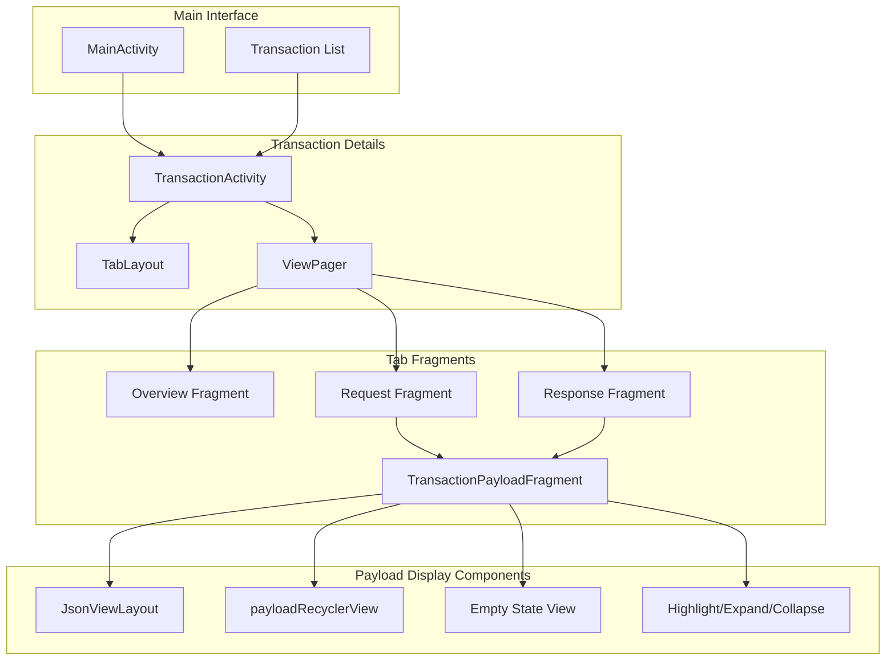
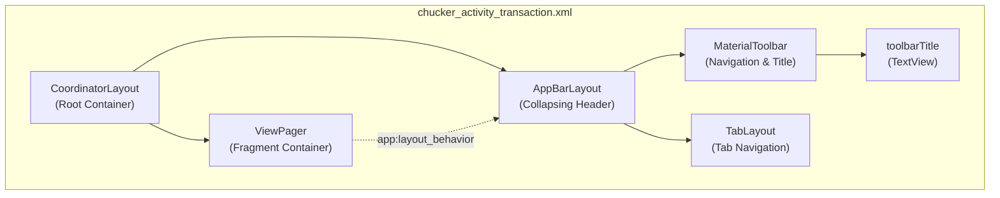
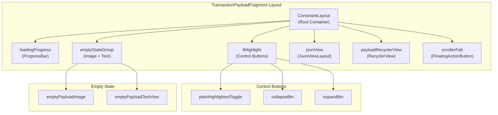
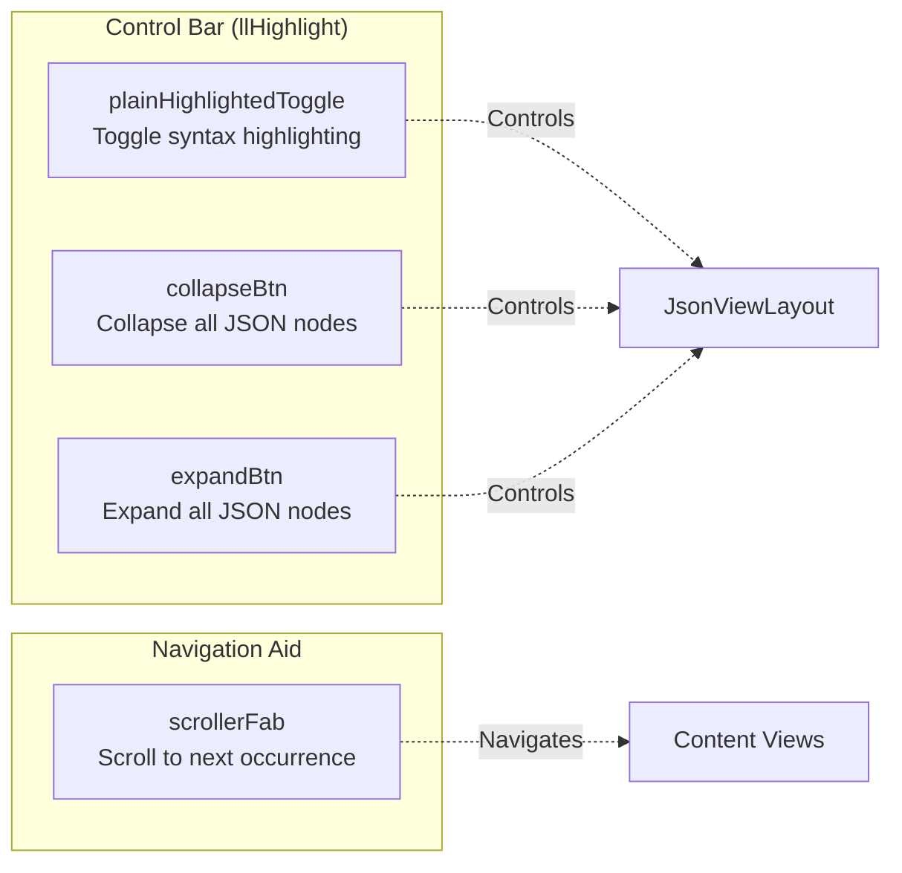
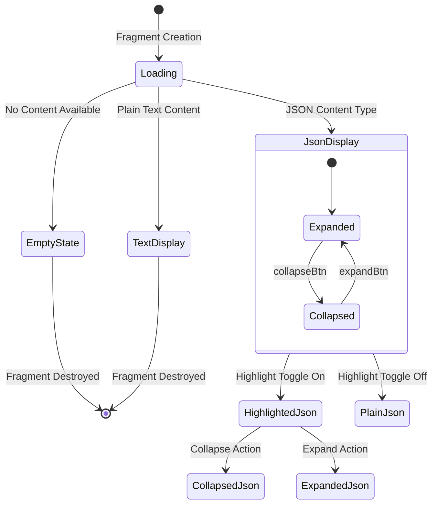
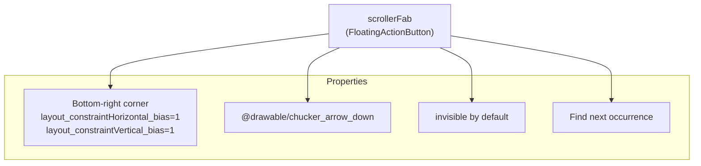

# Transaction Details

Relevant source files

The following files were used as context for generating this wiki page:

- [library/src/main/res/drawable/chucker_arrow_down.xml](library/src/main/res/drawable/chucker_arrow_down.xml)
- [library/src/main/res/layout/chucker_activity_transaction.xml](library/src/main/res/layout/chucker_activity_transaction.xml)
- [library/src/main/res/layout/chucker_fragment_transaction_payload.xml](library/src/main/res/layout/chucker_fragment_transaction_payload.xml)

This document covers the detailed view of individual HTTP transactions within Chucker's user interface. This includes the `TransactionActivity` that displays comprehensive information about a specific HTTP request/response pair, the tab-based navigation system, payload viewing capabilities, and interactive features for analyzing network traffic.

For information about the main transaction list interface, see [Main Interface](#4.1). For details about UI styling and customization, see [Styling and Theming](#4.3).

## Purpose and Architecture Overview

The transaction details system provides developers with an in-depth view of HTTP transactions captured by Chucker. The system is built around the `TransactionActivity` which presents transaction data through a tabbed interface, allowing users to examine different aspects of the HTTP communication including headers, request/response bodies, and metadata.

### Transaction Detail Flow Architecture

**Sources:** [library/src/main/res/layout/chucker_activity_transaction.xml:1-44](), [library/src/main/res/layout/chucker_fragment_transaction_payload.xml:1-143]()

## TransactionActivity Layout Structure

The `TransactionActivity` serves as the container for displaying detailed transaction information. It uses a coordinator layout with an app bar containing both toolbar and tab navigation.

### Core Layout Components

| Component | Purpose | Layout Reference |
|-----------|---------|------------------|
| `CoordinatorLayout` | Root container with scrolling behavior | [chucker_activity_transaction.xml:2]() |
| `AppBarLayout` | Contains toolbar and tabs with collapse behavior | [chucker_activity_transaction.xml:9-36]() |
| `MaterialToolbar` | Navigation and title display | [chucker_activity_transaction.xml:14-28]() |
| `TabLayout` | Tab navigation for different content views | [chucker_activity_transaction.xml:30-34]() |
| `ViewPager` | Hosts tab fragment content | [chucker_activity_transaction.xml:38-42]() |

### Activity Structure Diagram

**Sources:** [library/src/main/res/layout/chucker_activity_transaction.xml:7-44]()

## Payload Display System

The `TransactionPayloadFragment` handles the display of HTTP request and response bodies with multiple viewing modes and interactive controls. The fragment adapts its display based on content type and provides specialized viewers for different data formats.

### Payload Fragment Components

The payload fragment implements a sophisticated multi-view system for displaying various content types:

**Sources:** [library/src/main/res/layout/chucker_fragment_transaction_payload.xml:2-143]()

### Display Mode Components

| Component | Purpose | Visibility Control |
|-----------|---------|-------------------|
| `loadingProgress` | Shows loading state during content processing | Default visible, hidden when content loads |
| `jsonView` | Displays formatted JSON content with syntax highlighting | Shown for JSON payloads |
| `payloadRecyclerView` | Displays plain text content in scrollable format | Shown for non-JSON text content |
| `emptyStateGroup` | Shows when payload is empty or unavailable | Shown when no content available |
| `scrollerFab` | Navigation aid for large content | Shown for scrollable content |

**Sources:** [library/src/main/res/layout/chucker_fragment_transaction_payload.xml:10-141]()

## Interactive Controls and Features

### Content Manipulation Controls

The payload fragment provides several interactive controls for enhancing content readability:

### Control Button Specifications

| Button ID | Function | Default State | Content Type |
|-----------|----------|---------------|--------------|
| `plainHighlightedToggle` | Toggle between plain text and syntax-highlighted view | Gone (hidden) | JSON content |
| `collapseBtn` | Collapse all expandable JSON nodes | Gone (hidden) | Structured JSON |
| `expandBtn` | Expand all collapsed JSON nodes | Gone (hidden) | Structured JSON |
| `scrollerFab` | Navigate through search results or large content | Invisible | Large payloads |

**Sources:** [library/src/main/res/layout/chucker_fragment_transaction_payload.xml:59-86](), [library/src/main/res/layout/chucker_fragment_transaction_payload.xml:126-141]()

## Content Display States

### State Management System

The payload fragment implements a state-driven UI that adapts based on content availability and type:

### View Visibility Logic

| State | `loadingProgress` | `jsonView` | `payloadRecyclerView` | `emptyStateGroup` |
|-------|-------------------|------------|----------------------|-------------------|
| Loading | `visible` | `gone` | `invisible` | `gone` |
| Empty Content | `gone` | `gone` | `invisible` | `gone` → `visible` |
| JSON Content | `gone` | `gone` → `visible` | `invisible` | `gone` |
| Text Content | `gone` | `gone` | `invisible` → `visible` | `gone` |

**Sources:** [library/src/main/res/layout/chucker_fragment_transaction_payload.xml:10-20](), [library/src/main/res/layout/chucker_fragment_transaction_payload.xml:91-99](), [library/src/main/res/layout/chucker_fragment_transaction_payload.xml:102-116](), [library/src/main/res/layout/chucker_fragment_transaction_payload.xml:118-124]()

## Navigation and Layout Behavior

### Scroll and Navigation Components

The transaction detail interface includes sophisticated scrolling behavior and navigation aids:

| Component | Behavior | Purpose |
|-----------|----------|---------|
| `ViewPager` | Horizontal swipe navigation | Switch between Overview/Request/Response tabs |
| `AppBarLayout` | Collapsing toolbar behavior | Maximize content space while maintaining navigation |
| `payloadRecyclerView` | Vertical scrolling with scrollbars | Navigate large text content |
| `scrollerFab` | Context-aware navigation | Quick navigation through search results |

### Floating Action Button Navigation

The `scrollerFab` provides contextual navigation assistance:

**Sources:** [library/src/main/res/layout/chucker_fragment_transaction_payload.xml:126-141](), [library/src/main/res/drawable/chucker_arrow_down.xml:1-7]()
