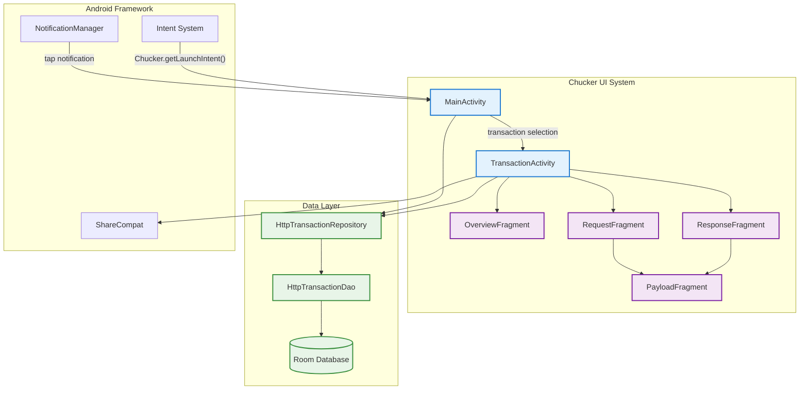
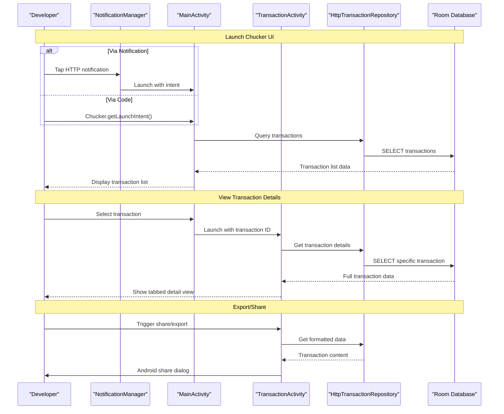

# User Interface

Relevant source files

The following files were used as context for generating this wiki page:

- [library/src/main/AndroidManifest.xml](library/src/main/AndroidManifest.xml)
- [library/src/main/res/values/strings.xml](library/src/main/res/values/strings.xml)

This document provides an overview of Chucker's user interface components and architecture. It covers the main UI screens, navigation patterns, and key interaction features that allow developers to inspect HTTP traffic captured by Chucker.

For specific implementation details of individual UI screens, see [Main Interface](#4.1) and [Transaction Details](#4.2). For UI customization options, see [Styling and Theming](#4.3).

## UI Architecture Overview

Chucker's user interface is built around a two-screen architecture that follows standard Android navigation patterns. The UI provides a comprehensive view of HTTP transactions with detailed inspection capabilities.

### UI Architecture Diagram

Sources: [library/src/main/AndroidManifest.xml:16-25]()

## Main UI Components

### Activities

Chucker's UI consists of two main activities declared in the Android manifest:

| Activity | Purpose | Navigation |
|----------|---------|------------|
| `MainActivity` | Transaction list and search | Entry point, launches `TransactionActivity` |
| `TransactionActivity` | Transaction details with tabbed interface | Child of `MainActivity`, contains fragments |

Both activities use the `Chucker.Theme` and have specific task affinity configuration to ensure proper behavior when launched from notifications or external intents.

### Key UI Features

The UI provides several core capabilities for HTTP transaction inspection:

**Transaction Management**
- Transaction list with search and filtering
- Clear all transactions functionality
- Real-time updates as new requests are captured

**Detail Inspection** 
- Tabbed interface for Overview, Request, and Response data
- Syntax highlighting for JSON, XML, and other structured content
- Raw and formatted view toggle
- Content expansion/collapse for large payloads

**Data Export and Sharing**
- Share individual transactions as cURL commands
- Export transaction data as text or HAR files
- Save request/response bodies to files
- Share functionality integrated with Android's sharing system

### UI Flow Diagram

Sources: [library/src/main/AndroidManifest.xml:15-25](), [library/src/main/res/values/strings.xml:3-66]()

## String Resources and Localization

Chucker's UI strings are centralized in the string resources file, providing consistent terminology and enabling localization. Key string categories include:

**Navigation and Actions**
- `chucker_name` - Application title
- `chucker_clear`, `chucker_share`, `chucker_export` - Primary actions
- `chucker_overview`, `chucker_request`, `chucker_response` - Tab labels

**HTTP Metadata Labels** 
- `chucker_url`, `chucker_method`, `chucker_protocol`, `chucker_status`
- `chucker_request_time`, `chucker_response_time`, `chucker_duration`
- `chucker_request_size`, `chucker_response_size`, `chucker_total_size`

**Content Display**
- `chucker_body_empty`, `chucker_body_omitted` - Empty state messages
- `chucker_show_plain`, `chucker_highlight` - View mode toggles
- `chucker_expand`, `chucker_collapse` - Content state controls

Sources: [library/src/main/res/values/strings.xml:1-66]()

## Integration Points

### Notification System

Chucker integrates with Android's notification system to provide quick access to the UI when HTTP traffic is being recorded. The notification category `chucker_network_notification_category` ensures proper notification grouping.

### File Provider

The UI includes file sharing capabilities through a custom `ChuckerFileProvider` that enables secure sharing of transaction data with external applications. This supports the export and share functionality for transaction details.

### Intent-Based Launch

The UI can be launched programmatically using `Chucker.getLaunchIntent()` or automatically through notification interactions. The `MainActivity` is configured with `singleTask` launch mode to ensure proper task management.

Sources: [library/src/main/AndroidManifest.xml:36-44](), [library/src/main/res/values/strings.xml:43-44]()

## Tutorial and Setup Integration

The UI includes built-in tutorial content to guide developers who haven't properly configured the interceptor. The `chucker_network_tutorial` string provides setup instructions, and `chucker_check_readme` links to detailed configuration documentation.

This integration ensures that the UI serves not only as an inspection tool but also as a configuration guide for proper Chucker setup.

Sources: [library/src/main/res/values/strings.xml:42](), [library/src/main/res/values/strings.xml:54-55]()
