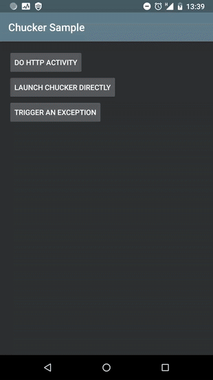
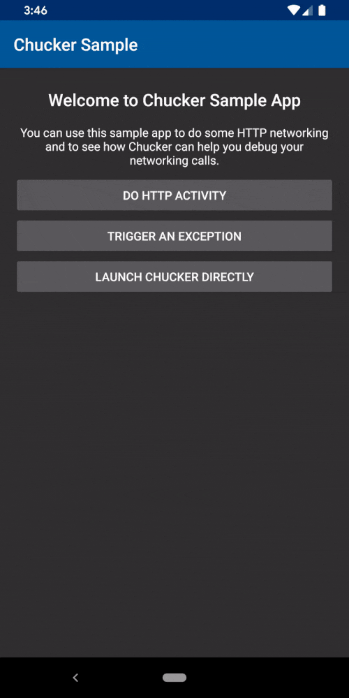
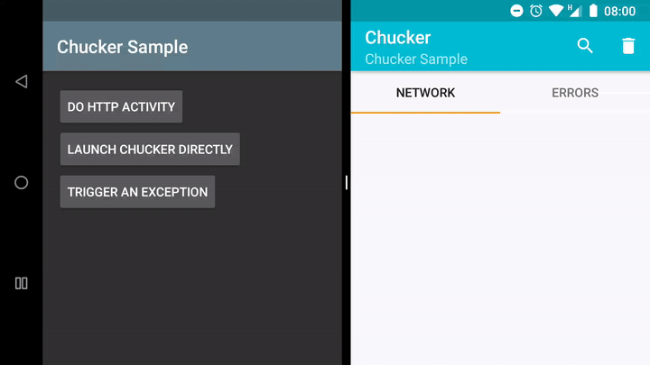

# Chucker

[](https://jitpack.io/#ChuckerTeam/Chucker) [](https://travis-ci.org/ChuckerTeam/chucker) [](https://androidweekly.net/issues/issue-375)  [](http://makeapullrequest.com)

_A fork of [Chuck](https://github.com/jgilfelt/chuck)_

<p align="center">
  
</p>

* [Getting Started](#getting-started-)
* [Features](#features-)
  * [Multi-Window](#multi-window-)
* [Configure](#configure-)
  * [Throwables](#throwables-️)
  * [Redact-Header️](#redact-header-️)
* [Migrating](#migrating-)
* [Snapshots](#snapshots-)
* [FAQ](#faq-)
* [Contributing](#contributing-)
* [Acknowledgments](#acknowledgments-)
* [License](#license-)

Chucker simplifies the inspection of **HTTP(S) requests/responses**, and **Throwables** fired by your Android App. Chucker works as a **OkHttp Interceptor** persisting all those events inside your application, and providing a UI for inspecting and sharing their content.

Apps using Chucker will display a **push notification** showing a summary of ongoing HTTP activity and Throwables. Tapping on the notification launches the full Chucker UI. Apps can optionally suppress the notification, and launch the Chucker UI directly from within their own interface.

| HTTP Calls | Throwables |
| --- | --- |
|  |  |

## Getting Started 👣

Chucker is distributed through [JitPack](https://jitpack.io/#ChuckerTeam/chucker). To use it you need to add the following **Gradle dependency** to your `build.gradle` file of you android app module (NOT the root file).

Please note that you should add both the `library` and the the `library-no-op` variant to isolate Chucker from release builds as follows:

```groovy
repositories {
    maven { url "https://jitpack.io" }
}
```

```groovy
dependencies {
  debugImplementation "com.github.ChuckerTeam.Chucker:library:3.0.1"
  releaseImplementation "com.github.ChuckerTeam.Chucker:library-no-op:3.0.1"
}
```

To start using Chucker, just plug it a new `ChuckerInterceptor` to your OkHttp Client Builder:

```kotlin
val client = OkHttpClient.Builder()
                .addInterceptor(ChuckerInterceptor(context))
                .build()
```

**That's it!** 🎉 Chucker will now record all HTTP interactions made by your OkHttp client.

## Features 🧰

Don't forget to check the [changelog](CHANGELOG.md) to have a look at all the changes in the latest version of Chucker.

* Compatible with **OkHTTP 4**
* **API >= 16** compatible
* Easy to integrate (just a 2 gradle implementation line).
* Works **out of the box**, no customization needed.
* **Empty release artifact** 🧼 (no traces of Chucker in your final APK).
* Support for body text search with **highlighting** 🕵️‍♂️
* Support for showing **images** in HTTP Responses 🖼

### Multi-Window 🚪

The main Chucker activity is launched in its own task, allowing it to be displayed alongside the host app UI using Android 7.x multi-window support.



## Configure 🎨

You can customize chucker providing an instance of a `ChuckerCollector`:

```kotlin
// Create the Collector
val chuckerCollector = ChuckerCollector(
        context = this,
        // Toggles visibility of the push notification
        showNotification = true,
        // Allows to customize the retention period of collected data
        retentionPeriod = RetentionManager.Period.ONE_HOUR
)

// Create the Interceptor
val chuckerInterceptor = ChuckerInterceptor(
        context = this,
        // The previously created Collector
        collector = chuckerCollector,
        // The max body content length, after this responses will be truncated.
        maxContentLength = 250000L,
        // List of headers to obfuscate in the Chucker UI
        headersToRedact = listOf("Auth-Token"))

// Don't forget to plug the ChuckerInterceptor inside the OkHttpClient
val client = OkHttpClient.Builder()
        .addInterceptor(chuckerInterceptor)
        .build()
```

### Throwables ☄️

Chucker supports also collecting and displaying **Throwables** of your application. To inform Chucker that a `Throwable` was fired you need to call the `onError` method of the `ChuckerCollector` (you need to retain an instance of your collector):

```kotlin
try {
    // Do something risky
} catch (exception: IOException) {
    chuckerCollector.onError("TAG", exception)
}
```

### Redact-Header 👮‍♂️

**Warning** The data generated and stored when using Chucker may contain sensitive information such as Authorization or Cookie headers, and the contents of request and response bodies. 

It is intended for **use during development**, and not in release builds or other production deployments.

You can redact headers that contain sensitive information by calling `redactHeader(String)` on the `ChuckerInterceptor`.

```kotlin
interceptor.redactHeader("Auth-Token")
interceptor.redactHeader("User-Session")
```

## Migrating 🚗

If you're migrating **from [Chuck](https://github.com/jgilfelt/chuck) to Chucker**, please refer to this [migration guide](/docs/migrating-from-chuck.md).

If you're migrating **from Chucker v2.0 to v3.0**, please expect multiple breaking changes. You can find documentation on how to update your code on this other [migration guide](/docs/migrating-from-2.0.md).


## Snapshots 📦

Development of Chucker happens in the [develop](https://github.com/ChuckerTeam/chucker/tree/develop) branch. You can get `SNAPSHOT` versions directly from JitPack if needed.

```gradle
repositories {
    maven { url "https://jitpack.io" }
}
```

```gradle
dependencies {
  debugImplementation "com.github.ChuckerTeam.Chucker:library:develop-SNAPSHOT"
  releaseImplementation "com.github.ChuckerTeam.Chucker:library-no-op:develop-SNAPSHOT"
}
```

⚠️ Please note that the latest snapshot might be **unstable**. Use it at your own risk ⚠️

If you're looking for the **latest stable version**, you can always find it on the top of the `release` branch.

## FAQ ❓

* Why are some of my request headers missing?
* Why are retries and redirects not being captured discretely?
* Why are my encoded request/response bodies not appearing as plain text?

Please refer to [this section of the OkHttp wiki](https://github.com/square/okhttp/wiki/Interceptors#choosing-between-application-and-network-interceptors). You can choose to use Chucker as either an application or network interceptor, depending on your requirements.

## Contributing 🤝

**We're looking for contributors! Don't be shy.** 😁 Feel free to open issues/pull requests to help me improve this project.

* When reporting a new Issue, make sure to attach **Screenshots**, **Videos** or **GIFs** of the problem you are reporting.
* When submitting a new PR, make sure tests are all green. Write new tests if necessary.

Short `TODO` List for new contributors:

- [ ] Kotlinize classes inside the `.internal` package.
- [ ] Have a empty state graphics/message for requests with no headers.
- [ ] Increment the test coverage.

## Acknowledgments 🌸

### Contributors

Big thanks to our contributors

- [Ashok Varma](https://github.com/Ashok-Varma) Clean up
- [Bernat Borrás Paronella](https://github.com/alorma) Redact headers + HTTP methods in notifications
- [Hafiz Waleed Hussain](https://github.com/Hafiz-Waleed-Hussain) Search highlight in response tab
- [Karol Wrótniak](https://github.com/koral--) Fix race condition + Application name retrieval
- [OlliZi](https://github.com/OlliZi) Support for images
- [Paul Hawke](https://github.com/psh) API Clean
- [Paul Woitaschek](https://github.com/PaulWoitaschek) Fix typo in API
- [SeungHun Choe](https://github.com/uOOOO) Fix memory leak

### Libraries

Chucker uses the following open source libraries:

- [OkHttp](https://github.com/square/okhttp) - Copyright Square, Inc.
- [Gson](https://github.com/google/gson) - Copyright Google Inc.
- [Room](https://developer.android.com/topic/libraries/architecture/room) - Copyright Google Inc.

## License 📄

```
    Copyright (C) 2018 Nicola Corti & Olivier Perez & Benoit Vermont.
    Copyright (C) 2017 Jeff Gilfelt.

    Licensed under the Apache License, Version 2.0 (the "License");
    you may not use this file except in compliance with the License.
    You may obtain a copy of the License at

       http://www.apache.org/licenses/LICENSE-2.0

    Unless required by applicable law or agreed to in writing, software
    distributed under the License is distributed on an "AS IS" BASIS,
    WITHOUT WARRANTIES OR CONDITIONS OF ANY KIND, either express or implied.
    See the License for the specific language governing permissions and
    limitations under the License.
```
